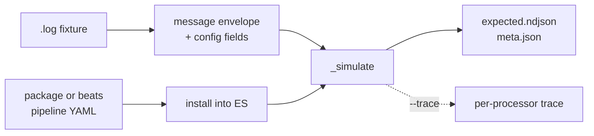

# compat -- confirmed output from the real Elastic engine

`scripts/compat.py` runs raw source data through Elastic's own ingest pipelines
in a throwaway Elasticsearch container and writes the resulting documents to
disk. Those documents are ground truth: what upstream actually produces, rather
than what we believe it produces.

Run it occasionally, when you need new ground truth. Everything downstream
reads the files it writes and needs no Docker.



## Prerequisites

- Docker, and roughly 2 GB free for the Elasticsearch container.
- Clones of `elastic/integrations` and `elastic/beats` in one directory.
  Point at them with `DFE_ELASTIC_SOURCES` or `--sources`; the default is
  `/projects/elastic-stuff`.
- Python 3.12+ with PyYAML. No virtualenv, no project dependency.

Confirm all of it before starting a container:

```bash
scripts/compat.py check
```

### What still needs the clones

Only two things, and both are periodic:

- **Generating the corpus.** The pipelines are read from `elastic/integrations`
  at a named commit, which is the point -- an independent reading of what
  Elastic does now, rather than what our vendored copy in `-dev/pipelines/`
  says. That distinction has already earned itself: the corpus shows the
  current okta pipeline setting `user.name` with a `copy_from`, where our
  vendored copy still groks `%{USER:user.name}` and drops the domain.
- **Refreshing `-dev/pipelines/`** when a vendored copy has fallen behind.

Everything else runs without them. `-dev` references the clones nowhere at all,
sample inputs live in `tests/fixtures/unencumbered/`, and once a corpus exists
on a machine the Rust comparison reads only files.

## Commands

| Command | What it does |
|---|---|
| `check` | Verify clones, fixtures and pipelines. Starts nothing. |
| `up` / `down` | Start or remove the container. `generate` and `audit` start it themselves. |
| `generate --source okta` | Write confirmed output for a source into the corpus. |
| `audit` | Compare every committed `-expected.json` against what the current pipelines produce. |

Options that apply to any command:

| Option | Effect |
|---|---|
| `--sources` | Where the clones live. Also `DFE_ELASTIC_SOURCES`. |
| `--corpus` | Where confirmed output is written. Also `DFE_COMPAT_CORPUS`. |
| `--es-version` | Which engine to run, default 9.2.2. Each version gets its own container. |
| `--ref` | Read pipelines at a git ref, e.g. `v7.17.9`. The clone is never modified. |
| `--geoip` | Resolve geo against our own DB-IP databases rather than none. |
| `--trace` | Capture the document after every processor. |

Traces run about 800 KB an event, so they are written outside the corpus and
are a debugging aid, not an artefact.

A stream with no fixtures upstream is reported and skipped, not failed --
fifteen of aws's metric streams and eleven of gcp's are like that. The
transform is still generated and wired; it simply has nothing to be scored
against. Naming a `--fixture` that matches nothing is still an error.

## The ratchet

`tests/compat-baseline.json` is the ratchet the corpus test asserts, and the
test prints the exact line for every source that improved.
`scripts/raise_baseline.py` applies them:

```
cargo test -p dfe-transforms --test compat_corpus -- --nocapture > /tmp/run.txt
python3 scripts/raise_baseline.py /tmp/run.txt
```

It REFUSES any line that would lower a score. A fall needs a stated reason and
is never mechanical.

### It refuses to be skipped quietly

The baseline is asserted only when the corpus on disk was captured at the
`integrations_sha` and engine version the baseline names. A score against
different pipelines is a different measurement, so ratcheting one against the
other would fail for the wrong reason.

Until 2026-09-03 that mismatch PRINTED and returned, and the run still exited
0. Regenerate the corpus at a new sha, forget to update the baseline, and
parity was unenforced with no signal, the message lost among thousands of
per-fixture lines. It now FAILS instead, naming the two shas.

`DFE_COMPAT_ALLOW_UNRATCHETED=1` is the acknowledgement, for the one
legitimate case: a regeneration in progress, where the corpus has moved and
the baseline has not caught up yet. It leaves parity unenforced for that run,
which is why it has to be typed.

A corpus that is ABSENT is a different thing and still skips silently -- the
corpus is gitignored, so a fresh clone has none.

### The second ratchet: patterns that never apply

`never_ran` in `tests/compat-baseline.json` holds the count of scripts that
bound a pattern and never once ran it. Read the number there rather than here:
a figure restated in prose is stale the next time the ratchet moves.

This is the class the work in early September kept finding: a ladder arm with a
bare `contains()` trigger claims a script its runner then declines on every
event. The static census counts it as covered and the Painless coverage floor
reads 100%, because both measure whether a pattern MATCHED. Only running the
corpus shows whether it applied.

It is not a defect count. A script can legitimately never run because no event
in the corpus carries its source field, so read it with
`scripts/pattern_reach.py`, which joins the reach data to call sites, and never
on its own.

`DFE_PAINLESS_UNHANDLED=<path>` writes the per-script catalogue. The catalogue
is now on for every run: its write lock is taken once per script EXECUTION,
about 70,500 times over the whole corpus, and the run measured 18.6s against
17.7-19.8s with it off.

### Choosing which unclaimed script to work next

    scripts/next_targets.py <DFE_PAINLESS_UNHANDLED dump> <corpus run>

The catalogue ranks by REACH and the corpus summary ranks by DEBT, and the two
answer different questions. Ranking by reach alone once sent a delegate at the
three heaviest unclaimed scripts in the catalogue, worth 44 fields between them,
because all three of their sources were already at or near 100%.

The tool does the joins: it drops every script with `ran > 0` -- a matcher that
claims a script and declines on events lacking its field is working correctly,
which the whole winlog `event.code` family looks like -- maps the rest to their
owning module, and joins to that source's debt.

Read the wrong-on column beside each row before writing anything. A source's
debt is the CEILING on what its script can buy, not the value: `filterMassive`
ranks first on servicenow at 157 wrong fields and writes none of them.

One step the tool cannot do: check the corpus CONTAINS the data the script keys
on. `rg -cl "<a literal the script tests>" testdata/compat/` answers it in one
command, and it is what established `cisco_asa`'s heaviest script as worth zero
-- no certificate event in the corpus, so its own null guard returns on all 512.

### It does not gate EXTRA fields

`fields_wrong` counts missing and mismatched fields only. A field we emit that
Elasticsearch does not is counted separately as `fields_extra`, printed in the
run and compared against nothing.

An event still needs an empty diff to count as matched, so extras are gated at
EVENT granularity -- but on a source already scoring zero matched events, which
is most of the ones carrying real debt, nothing checks them at all. The run
prints the current figure; it is not restated here, for the same reason.

Extras are the best single signal that a source is emitting a RAW shape rather
than the parsed one. axonius carried 2,313 of them on 3,705 fields, all of the
form `<base>.event.data.<name>` where Elasticsearch had `<base>.<name>` -- one
unread hoist, and reading it took the source from 11% of events to 94%.

So **record the extras figure before and after any change to the pattern
ladder**. A pattern that stops claiming a script hands it to whatever sits
below, and if
that writes a field Elastic never emits, the totals hold while only the extras
move -- which the ratchet passes green. That has happened once and the change
was reverted; it was caught by having written the previous number down and by
nothing else.

## What matters, and what does not

Byte equality is not the goal. `tests/compare-policy.yaml` is the single
definition of which differences are defects, read by this tool and by the Rust
comparison harness. Every rule carries a reason, and every run reports what it
excluded:

```text
excluded 156 field differences by 5 rules:
      93x  source.geo    DB-IP Lite against MaxMind GeoLite2.
      24x  tags          Beats and test-harness tagging. Not vendor data.
```

Differences are sorted into four columns:

- **real** -- the only one that means something is wrong.
- **order** -- same members, different sequence, for fields the policy declares
  to be sets. An undeclared array in a different order is still real.
- **meta** -- Elastic and Beats plumbing DFE does not emit.
- **enrich** -- GeoIP and user agent, which we knowingly resolve differently.

Each fixture's own `dynamic_fields` and `numeric_keyword_fields` are honoured
on top of the policy. A source reports `CURRENT` when `real` is zero, and the
`clean` count is the events with no real difference.

**The corpus test runs with GeoIP OFF** (`geoip_global::disable`). Skipping the
geo fields is not enough, because the enrichment has side effects that ARE
compared: gcp/vpcflow renames `source.as.asn` onto `source.as.number`, and an
ASN hit DB-IP Lite has where MaxMind's GeoLite2 does not makes that rename land
on an occupied target -- which fails the document and skips the twenty-nine
removes behind it, costing 262 events. Comparing against output built from a
database we do not have means running without one. The committed fixtures under
`tests/fixtures/` still exercise enrichment as a floor.

## Correct beats bug-compatible

The corpus is the reference for what a pipeline MEANS, not a specification of
what Elasticsearch does in every case. Where its output is wrong, we emit the
right value and record the divergence -- we do not reproduce the bug.

Two live examples. Elasticsearch 9.2.2 overflows a 2,826 ms duration to
`event.duration: -1468967296` where the correct value is 2,826,000,000, because
it multiplies into a 32-bit int. And cisco_nexus ships 27 events whose
timestamp its own date processor cannot parse, so it emits
`event.kind: pipeline_error` where we emit a correctly parsed event.

Both are recorded in `tests/compare-policy.yaml` with the reason attached, so
the difference is excluded from scoring and stays visible to anyone reading it.
A divergence taken this way is a decision with a name on it, and it is never
the quiet option: matching the bug would have scored better.

## Older stacks

Every committed expectation declares ECS 1.12.0, which is the Beats 7 era,
while the current pipelines emit ECS 8.x. To compare a source against the
engine and pipelines of its own vintage, pin both:

```bash
scripts/compat.py --es-version 7.17.9 --ref v7.17.9 audit --source panw
```

Pipelines are read with `git show`, so a shared clone is never checked out from
under anyone. The integrations repository publishes no tags, so use a commit or
a date-resolved ref there.

## Two lineages

The fixture corpus carries expectations from two different engines, and the
audit routes each file to the one that produced it:

- **integrations** -- okta, crowdstrike, fortinet, cisco_ios, cisco_meraki,
  cisco_nexus. The whole transformation lives in the ingest pipeline, so compat
  gives complete ground truth.
- **beats** -- azure (four data streams), o365, panw. Detected by the presence
  of `fileset.name`, `log.offset`, `event.module` or `input.type`.

Three azure fixture directories hold a mixture of both.

## Known limits

- **o365 and panw are incomplete.** Part of their transformation runs inside
  Filebeat before Elasticsearch sees the event: o365 has a Javascript processor
  chain in `config/pipeline.js`, and panw applies `decode_csv_fields` to
  `message`. The simulate API cannot reach either, so for those two the
  confirmed output covers only the Elasticsearch half.
- **GeoIP needs a patched database.** Elasticsearch matches the mmdb metadata
  `database_type` against an allowlist and rejects DB-IP. `--geoip` rewrites
  that one string into a patched copy under `testdata/geoip-patched/`, leaving
  the data section untouched. The originals are not modified.
- **No source is at zero real differences except azure_platformlogs.** The
  audit measures the gap; it does not close it.

## Using it on a source

Reach for compat when you need to know what upstream actually produces, rather
than what a committed expectation says it produced at some unrecorded point.

1. `check`, then `audit --source <name>` to see where the source stands. The
   `real` column is the work; everything else is already explained.
2. Read the top real differences. A field failing on every event is usually one
   processor, not many.
3. `generate --source <name> --trace` when you need to see which processor
   first diverges. The trace carries the document after every step.
4. Fix the transform, re-run `audit`. The corpus needs no container to compare
   against once generated.

Working on a source with no committed expectation, or on raw data nobody has a
fixture for, is the case compat exists for: feed it in, and the confirmed
output becomes the expectation.

## Licence

The corpus derives from Elastic-Licensed pipelines, so it defaults into the
ignored `testdata/` tree and is not committed. See
`/projects/elastic-stuff/MANIFEST.md` for the provenance of the upstream
material. Whether any of it may be redistributed is not an engineering
decision.

The Elasticsearch image is likewise a development dependency only and must
never become part of the shipped service.
