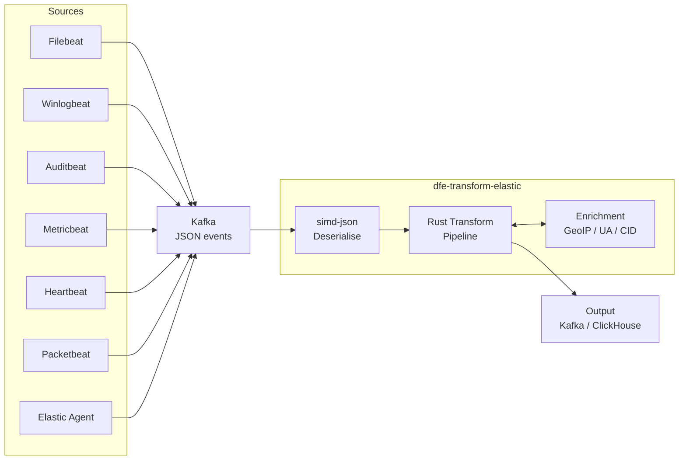
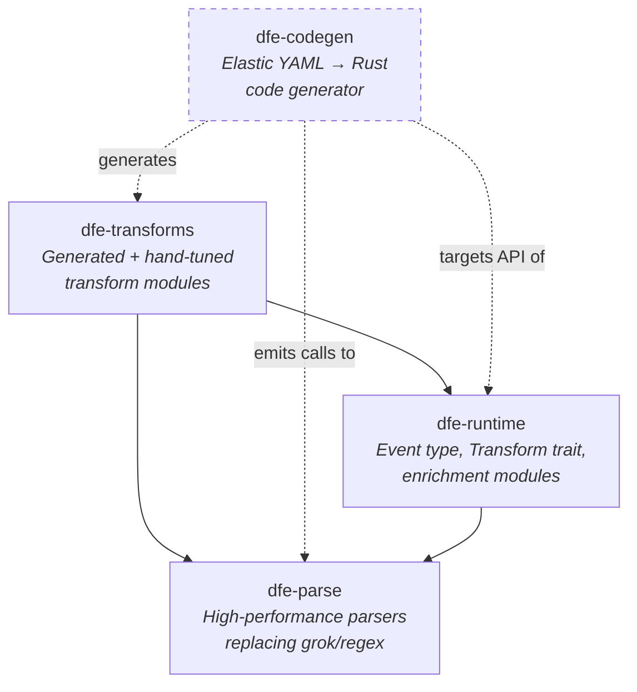
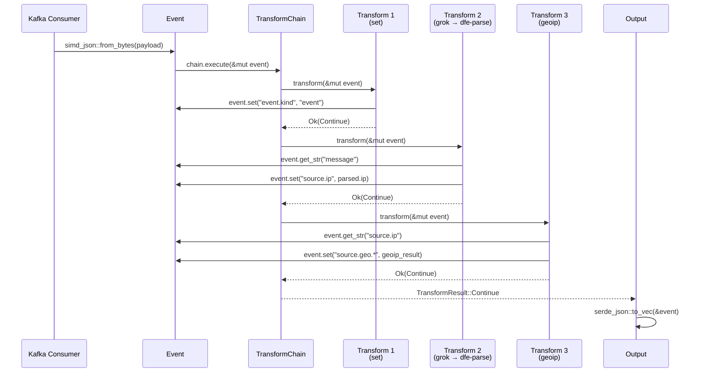
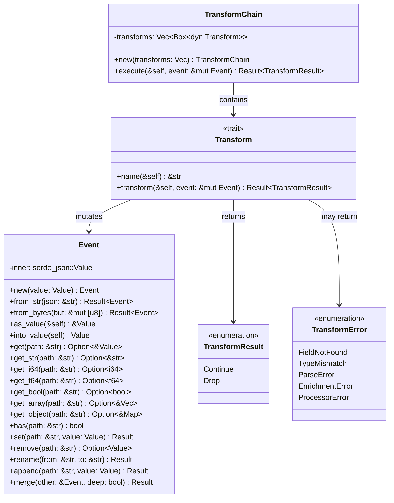
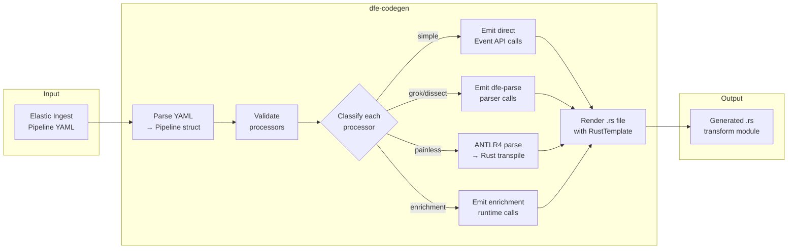
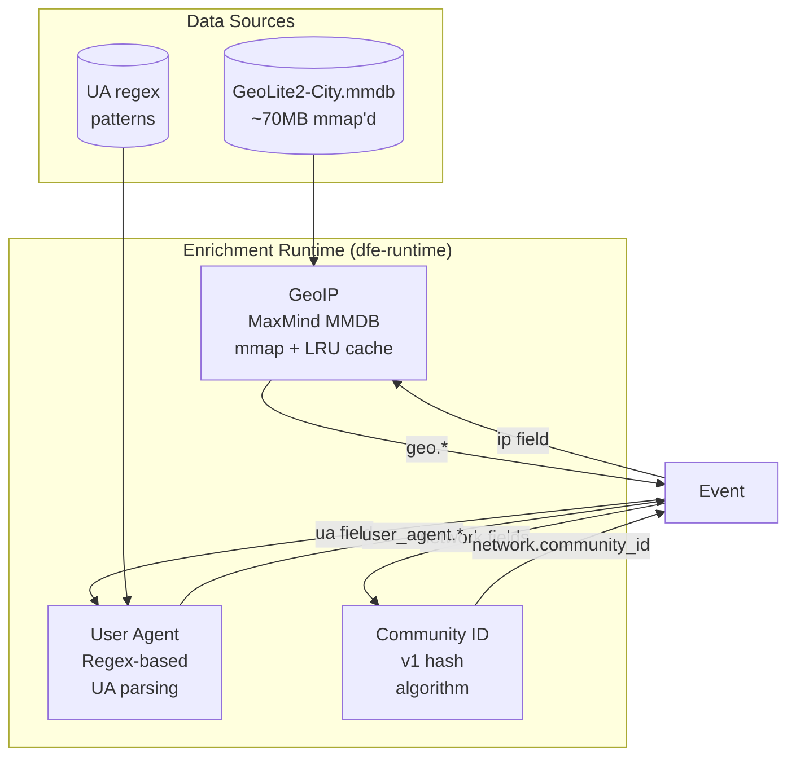
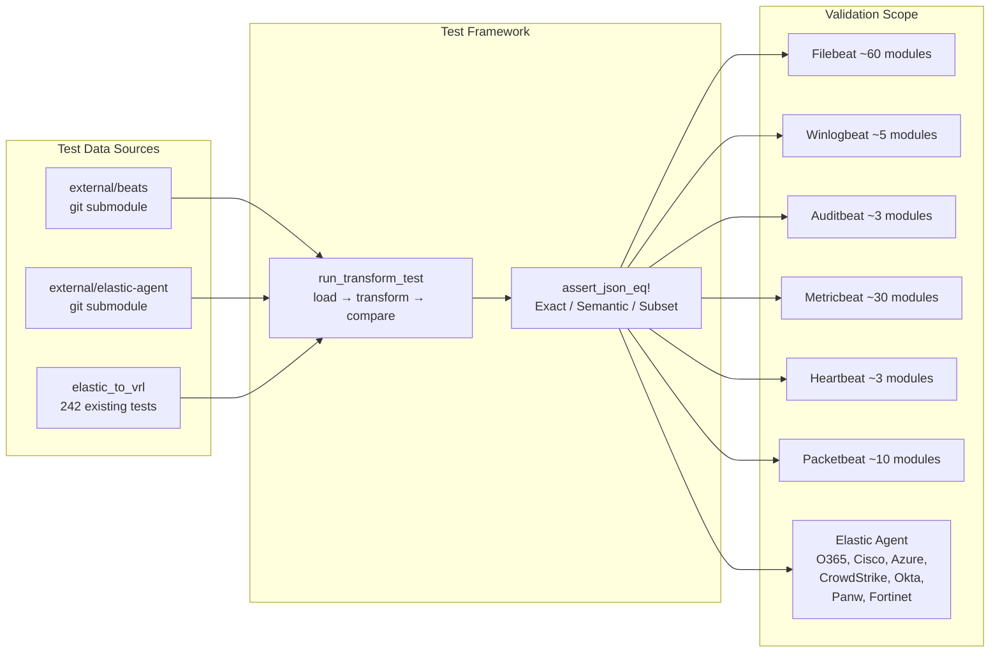

# Architecture Design

**Project:** dfe-transform-elastic
**Purpose:** Rust-optimised transform pipeline for Elastic Stack data (Beats + Elastic Agent) ingested via Kafka

Replaces Vector VRL transforms (~115 templates, ~54k lines) with native Rust for 10-20x
hot-path performance improvement. Converts Elastic ingest pipeline logic (Painless scripts
+ processors) to compiled Rust transform functions.

---

## System Context

Where dfe-transform-elastic fits in the Data Fusion Engine pipeline:



**Input:** JSON events from Kafka (all Beats sources + Elastic Agent integrations)
**Transform:** Elastic ingest pipeline logic converted to native Rust
**Output:** Transformed, normalised events (to Kafka, ClickHouse via dfe-loader, or other sinks)

---

## Crate Dependency Graph



**Solid arrows:** compile-time crate dependencies (`Cargo.toml`)
**Dashed arrows:** codegen-time relationships (dfe-codegen generates code that uses dfe-runtime and dfe-parse)

| Crate | Type | Purpose |
|-------|------|---------|
| `dfe-parse` | Library | Zero-copy parsers replacing grok/regex patterns |
| `dfe-runtime` | Library | Event type, Transform trait, enrichment modules |
| `dfe-codegen` | Binary + Library | Elastic ingest pipeline YAML → Rust code generator |
| `dfe-transforms` | Library | Generated + hand-tuned transform modules per data source |

---

## Event Lifecycle

From Kafka message bytes to transformed output:



---

## Event Model

The `Event` type wraps `serde_json::Value` with dotted-path navigation for ECS field access.



### Dotted-Path Access

All field access uses ECS-style dotted paths (e.g., `source.geo.city_name`). The `set()` method
auto-creates intermediate objects:

```rust
// Navigates into {"source": {"geo": {"city_name": ...}}}
event.get_str("source.geo.city_name")

// Creates {"source": {"geo": {}}} if missing, then sets city_name
event.set("source.geo.city_name", "Sydney")?;
```

### Design Decisions

- **`serde_json::Value` over custom types:** Simpler to implement, compatible with simd-json's `OwnedValue` conversion. Typed structs can be layered on later for hot-path fields.
- **`from_bytes` uses simd-json:** The primary Kafka ingestion path uses `simd_json::from_slice` for 2-3x faster deserialisation. `from_str` uses `serde_json` as fallback.
- **Dotted-path splitting:** Split on `.` with no escaping. ECS field names never contain dots within a single field segment.

---

## Transform Pipeline

How transforms compose and handle errors:


### Error Handling Strategy

Mirrors Elastic ingest pipeline semantics:

| Elastic Behaviour | Rust Implementation |
|---|---|
| `on_failure` block | Nested `TransformChain` executed on error |
| `ignore_failure: true` | Wrap in `.ok()` / `let _ =`, continue |
| No error handling | Propagate error, stop chain |
| `tag` on failure | `event.append("tags", "error_tag")` |

### Transform Trait Contract

```rust
pub trait Transform: Send + Sync {
    /// Human-readable processor name (for error context)
    fn name(&self) -> &str;

    /// Apply transform to event, returning Continue or Drop
    fn transform(&self, event: &mut Event) -> Result<TransformResult>;
}
```

- **Object-safe:** `dyn Transform` for heterogeneous chains
- **`Send + Sync`:** Safe for concurrent use across threads
- **Infallible transforms** (set, remove, rename) still return `Result` for uniform error propagation

---

## Parser Architecture

Three-layer strategy replacing grok/regex with native Rust:

```mermaid
flowchart TD
    input[Grok Pattern String] --> expand[Expand grok aliases<br/>%{IP} → regex]
    expand --> analyse{Analyse each<br/>capture group}

    analyse -->|All replaceable| l1[Layer 1: Native Parsers<br/>parse_ipv4, parse_int, etc.<br/><b>10-20x faster</b>]
    analyse -->|Some replaceable| l2[Layer 2: Composite<br/>Chain L1 parsers +<br/>literal separators<br/><b>10-15x faster</b>]
    analyse -->|Irreducibly complex| l3[Layer 3: DFA Fallback<br/>regex-automata pre-compiled<br/><b>2-5x faster</b>]

    l1 --> output[Generated Rust code<br/>in dfe-transforms]
    l2 --> output
    l3 --> output

    style l1 fill:#2d5,stroke:#1a3,color:#fff
    style l2 fill:#28a,stroke:#167,color:#fff
    style l3 fill:#a72,stroke:#841,color:#fff
```

### Layer 1: Common Pattern Replacements

Zero-regex native Rust parsers for the 15 most common grok patterns:

| Grok Pattern | Rust Parser | Technique |
|---|---|---|
| `%{IPV4}` | `parse_ipv4()` | Octet validation, direct byte scan |
| `%{IPV6}` | `parse_ipv6()` | Colon-group parser |
| `%{IPORHOST}` | `parse_ip_or_host()` | Try IP first, fall back to hostname |
| `%{INT}` | `parse_int::<T>()` | Direct digit scan, generic over type |
| `%{NUMBER}` | `parse_number()` | Integer or float with optional exponent |
| `%{WORD}` | `take_word()` | Byte-level alphanumeric scan |
| `%{GREEDYDATA}` | `take_greedy()` | Return remaining slice (zero cost) |
| `%{TIMESTAMP_ISO8601}` | `parse_iso8601()` | Fixed-position field extraction |
| `%{SYSLOGTIMESTAMP}` | `parse_syslog_timestamp()` | Month lookup table + digit parse |
| `%{LOGLEVEL}` | `parse_loglevel()` | Case-insensitive keyword match |
| `%{QUOTEDSTRING}` | `take_quoted()` | memchr for quote, handle escapes |
| `%{HOSTNAME}` | `parse_hostname()` | Label-dot-label (RFC 1123) |
| `%{MAC}` | `parse_mac()` | Fixed 6-group hex parse |
| `%{URI}` | `parse_uri()` | scheme://authority/path?query#fragment |
| `%{UUID}` | `parse_uuid()` | Fixed 8-4-4-4-12 hex pattern |

**Parser convention:** All parsers take `&str`, return `ParseResult<'_, T>` where
`T` is the parsed value (often `&str` for zero-copy):

```rust
pub type ParseResult<'a, T> = Result<(&'a str, T), ParseError>;
```

The return tuple contains `(remaining_input, parsed_value)`, following winnow/nom convention.

### Layer 2: Composite Parser Builder

Chains Layer 1 parsers with literal separators for full grok patterns:

```rust
// Grok: %{IPORHOST:source_ip}:%{INT:source_port} -> %{IPORHOST:dest_ip}:%{INT:dest_port}
// Becomes:
let parser = CompositeParser::builder()
    .capture("source_ip", parse_ip_or_host)
    .literal(":")
    .capture("source_port", parse_int::<u16>)
    .literal(" -> ")
    .capture("dest_ip", parse_ip_or_host)
    .literal(":")
    .capture("dest_port", parse_int::<u16>)
    .build();
```

### Layer 3: Pre-compiled DFA Fallback

For patterns that can't be decomposed into Layer 1/2:

- Compile regex to DFA at build time via `regex-automata`
- Serialise DFA bytes, load at runtime with zero compilation cost
- Named capture groups mapped to field names

### Performance Targets

| Operation | Regex/Grok | Native Rust | Expected Speedup |
|---|---|---|---|
| IP address parse | ~200ns | ~15ns | ~13x |
| Timestamp (ISO8601) | ~500ns | ~40ns | ~12x |
| Integer parse | ~100ns | ~10ns | ~10x |
| Syslog header (5 fields) | ~2us | ~100ns | ~20x |
| JSON parse (1KB event) | ~3us (serde) | ~1us (simd-json) | ~3x |
| Full DNS log line (8 fields) | ~5us | ~300ns | ~15x |

---

## Codegen Pipeline

How dfe-codegen converts Elastic ingest pipeline YAML to Rust transform code:



### Codegen Output Format

Each pipeline becomes a Rust module in `dfe-transforms`:

```rust
// Generated by dfe-codegen from filebeat/module/dns/pipeline.yml
use dfe_runtime::prelude::*;
use dfe_parse::{parse_ip_or_host, parse_int, parse_iso8601};

pub fn transform(event: &mut Event) -> Result<TransformResult> {
    // set processor
    event.set("event.kind", "event")?;

    // grok processor → Layer 2 composite parser
    if let Some(message) = event.get_str("message") {
        let fields = parsers::dns_query(message)?;
        event.set("dns.question.name", fields.question_name)?;
        event.set("source.ip", fields.source_ip)?;
        event.set("source.port", fields.source_port)?;
    }

    // date processor
    if let Some(ts) = event.get_str("_temp.timestamp") {
        let dt = parse_iso8601(ts)?.1;
        event.set("@timestamp", dt.to_rfc3339())?;
    }

    // geoip processor
    enrichment::geoip::enrich(event, "source.ip", "source.geo")?;

    Ok(TransformResult::Continue)
}
```

### Reuse from elastic_to_vrl

| Component | Lines | Reuse % | Action |
|---|---|---|---|
| ANTLR4 Painless parser | ~15,000 | 100% | Copy as-is |
| Pipeline structs + validation | ~5,700 | ~70% | Adapt imports |
| 28 processor transpilers | ~12,300 | ~40% | Rewrite template layer |
| **Total** | **~33,000** | | **~9,100 new lines** |

---

## Processor Taxonomy

### Simple Processors (~11)

Direct `Event` API calls, no parser dependency:

| Processor | Generated Code Pattern |
|---|---|
| `set` | `event.set(path, value)?` with conditional + value interpolation |
| `append` | `event.append(path, value)?` |
| `remove` | `event.remove(path)` |
| `rename` | `event.rename(from, to)?` |
| `uppercase` | `event.set(path, s.to_uppercase())?` |
| `lowercase` | `event.set(path, s.to_lowercase())?` |
| `trim` | `event.set(path, s.trim())?` |
| `convert` | Type coercion: `str→i64`, `str→f64`, `i64→str`, etc. |
| `drop` | `return Ok(TransformResult::Drop)` |
| `split` | `event.set(path, s.split(sep).collect())?` |
| `uri_parts` | Parse URI into scheme, host, port, path, query components |

### Medium Processors (~8)

Require dfe-parse integration:

| Processor | Parser Layer | Generated Code Pattern |
|---|---|---|
| `grok` | L1/L2/L3 | Emit parser calls based on grok analysis |
| `dissect` | Custom | Emit tokenizer-based split parsers |
| `json` | — | `simd_json::from_str` / `serde_json::from_str` |
| `kv` | Custom | Key-value split with configurable delimiters |
| `csv` | Custom | CSV field parsing with separator/quote config |
| `foreach` | — | `for item in event.get_array(path)` iteration |
| `date` | L1 | `dfe_parse::parse_iso8601` / `parse_syslog_timestamp` |
| `gsub` | Regex | `regex::Regex::replace_all` |

### Complex Processors (~8)

Require enrichment runtime or complex transpilation:

| Processor | Dependency | Generated Code Pattern |
|---|---|---|
| `script` (Painless) | ANTLR4 transpiler | Rust expressions from Painless AST |
| `geoip` | MaxMind MMDB | `enrichment::geoip::enrich(event, field, prefix)?` |
| `user_agent` | UA regex lib | `enrichment::user_agent::enrich(event, field, prefix)?` |
| `community_id` | Hash algorithm | `enrichment::community_id::enrich(event)?` |
| `registered_domain` | Public suffix list | Domain → registered_domain + subdomain |
| `network_direction` | CIDR config | Internal/external IP classification |
| `fingerprint` | Hash libs | SHA-256/SHA-1/MD5/MurmurHash3 fingerprinting |
| `pipeline` (nested) | Pipeline resolver | Sub-chain execution |

---

## Enrichment Architecture

Runtime enrichment modules loaded once, shared across transforms:



### Enrichment Trait

```rust
pub trait Enrichment: Send + Sync {
    fn enrich(&self, event: &mut Event) -> Result<()>;
}
```

### GeoIP Design

- **Storage:** mmap'd MMDB via `maxminddb` crate (zero-copy read)
- **Cache:** LRU cache (configurable size, default 10,000 entries) for repeated IPs
- **Output fields:** `country_name`, `country_iso_code`, `city_name`, `location.lat`, `location.lon`, `continent_name`, `timezone`
- **Failure:** `ignore_missing` support, errors tagged not fatal

### User Agent Design

- **Parser:** Regex-based UA string parsing
- **Output fields:** `name`, `version`, `os.name`, `os.version`, `device.name`, `device.type`

### Community ID Design

- **Algorithm:** Community ID v1 (SHA-1 based network flow hash)
- **Input fields:** `source.ip`, `destination.ip`, `source.port`, `destination.port`, `network.transport`
- **Output:** `network.community_id` (e.g., `1:LQU9qZlK+B5F3KDmev6m5PMibrg=`)

---

## Testing Strategy



### Match Modes

| Mode | Use Case | Behaviour |
|---|---|---|
| **Exact** | Default | Field-for-field JSON match |
| **Semantic** | Non-deterministic fields | Ignore timestamps with "now", generated UUIDs |
| **Subset** | Fields set by Beats runtime | Expected is subset of actual (extra fields OK) |

### Benchmark Framework

- **Per-parser:** Criterion benchmarks comparing each dfe-parse parser against regex equivalent
- **Per-transform:** Generated Rust vs VRL equivalent throughput
- **End-to-end:** Full pipeline (JSON deserialise → transform chain → serialise)

---

## Performance Architecture

### SIMD Acceleration

| Library | Use | SIMD Features |
|---|---|---|
| `simd-json` | Kafka JSON deserialisation | AVX2/SSE4.2/NEON structural character detection |
| `memchr` | Delimiter scanning in parsers | AVX2/SSE2 byte search |
| `aho-corasick` | Multi-pattern matching (log levels, keywords) | Teddy SIMD algorithm |
| `regex-automata` | Layer 3 DFA fallback | Compiled DFA (no backtracking) |

Build targets in `.cargo/config.toml`:
- **x86_64 release:** `-C target-cpu=x86-64-v3` (AVX2, BMI1/2, FMA — Haswell+)
- **aarch64 release:** `-C target-cpu=generic` (NEON baseline)
- **Development:** `-C target-cpu=native`

### Zero-Copy Patterns

1. **Kafka → Event:** `simd_json::from_slice(&mut bytes)` borrows strings from message buffer
2. **Parser returns:** `ParseResult<'a, &'a str>` — parsed values reference input slice
3. **Field access:** `event.get_str()` returns `Option<&str>` borrowing from inner Value
4. **Cow for transforms:** `Cow<'_, str>` when field may or may not need modification

### Buffer Reuse

- Pre-allocated `Vec<u8>` buffers for serialisation output
- `String` buffers cleared and reused across events for format operations
- `Vec::with_capacity()` based on expected batch sizes

### Release Profile

```toml
[profile.release]
lto = "thin"
codegen-units = 1
panic = "abort"
strip = true
opt-level = 3
```

---

## Appendix: Key Dependencies

| Crate | Version | Purpose |
|---|---|---|
| `simd-json` | >=0.14, <0.15 | SIMD JSON parsing (known-key feature) |
| `serde` / `serde_json` | 1.x | Serialisation framework |
| `winnow` | >=0.6 | Parser combinators (new code) |
| `memchr` | >=2.7 | SIMD byte search |
| `aho-corasick` | >=1.1 | Multi-pattern matching |
| `regex-automata` | >=0.4 | Pre-compiled DFA regex |
| `chrono` | >=0.4 | Timestamp handling |
| `maxminddb` | >=0.24 | GeoIP lookups (mmap, simdutf8) |
| `antlr-rust` | 0.3.0-beta | ANTLR4 Painless parser |
| `gtmpl` | >=0.7 | Go template engine (codegen) |
| `thiserror` | 2.x | Error derive macros |
| `tokio` | >=1.48 | Async runtime |
| `criterion` | >=0.5 | Benchmarking framework |
