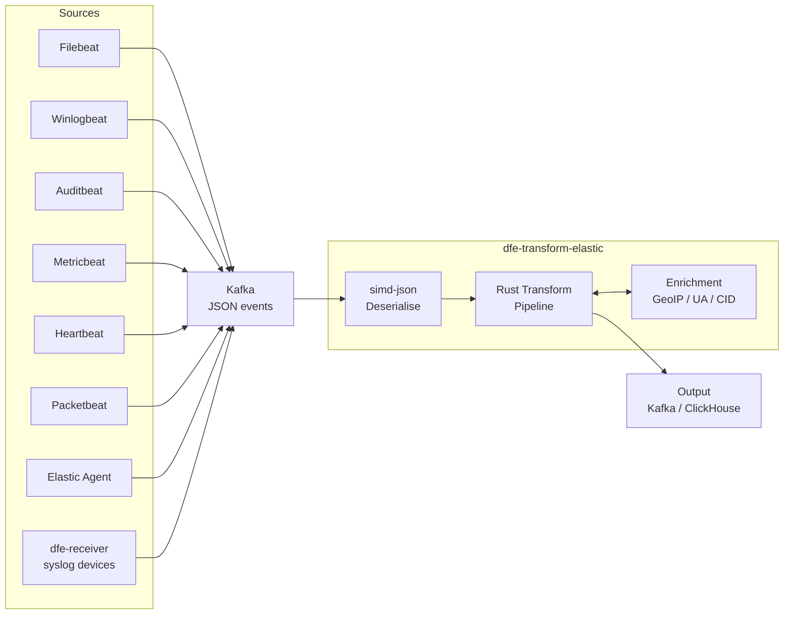
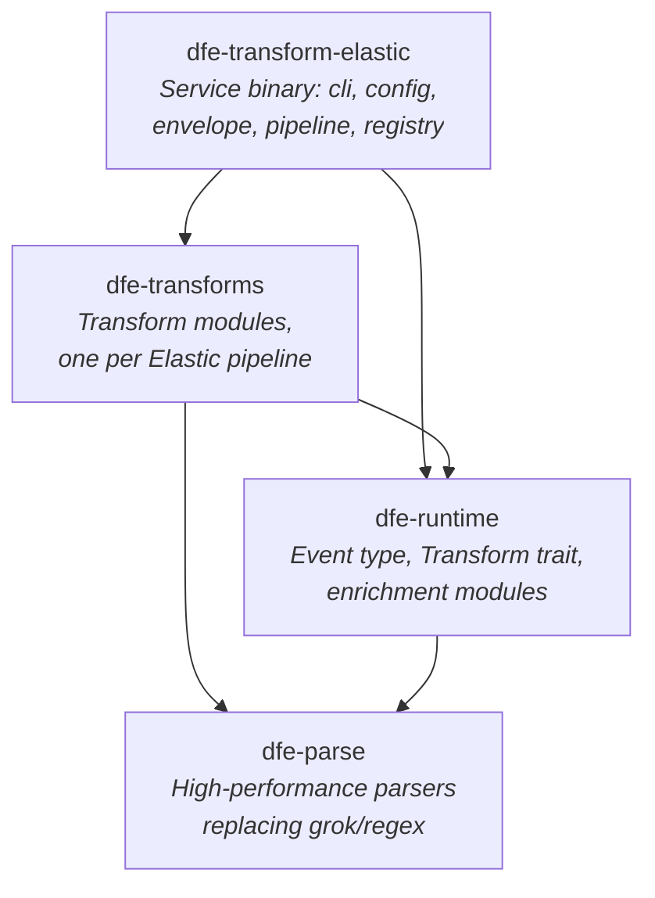
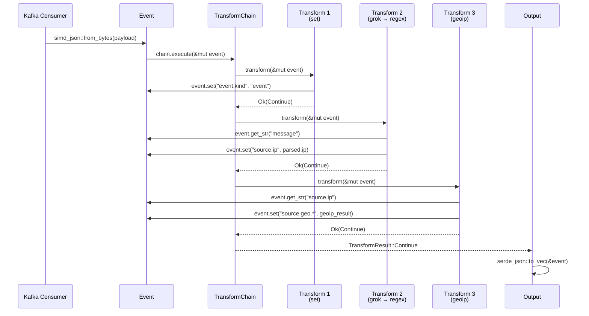
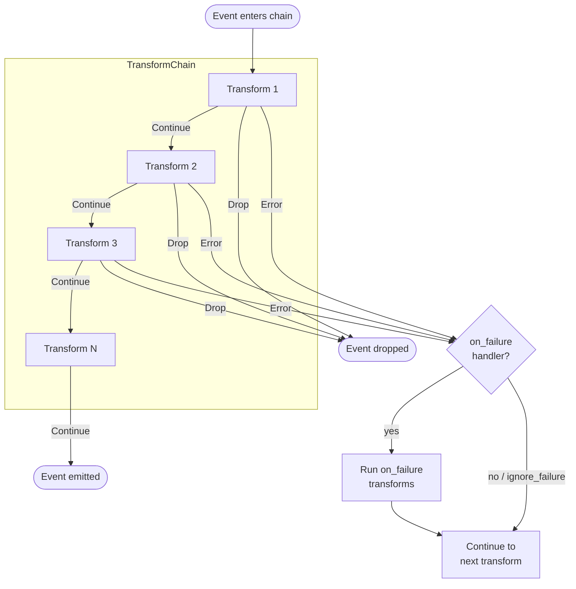
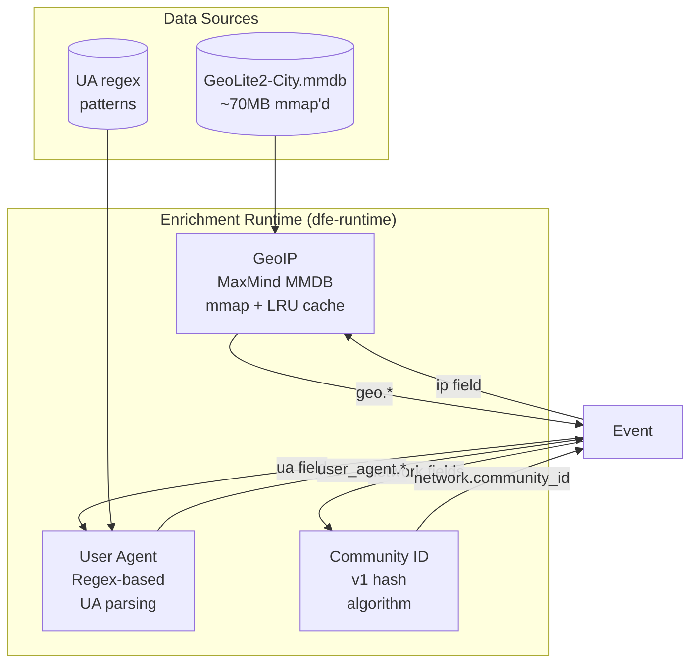
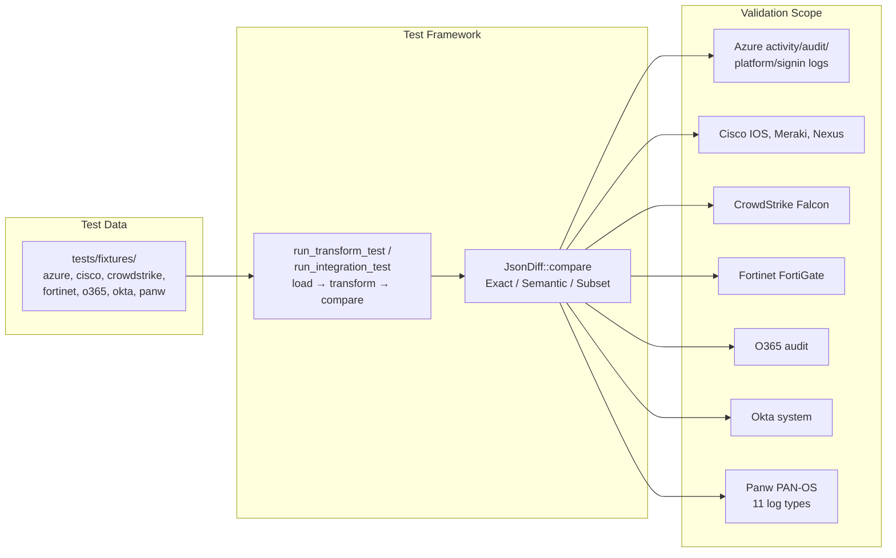

# Architecture Design

**Project:** dfe-transform-elastic
**Purpose:** Rust-optimised transform service for Elastic Stack data (Beats + Elastic Agent) ingested via Kafka

Converts Elastic ingest pipeline logic (Painless scripts + processors) into compiled Rust
transform functions, one module per source. There is no interpreter, no scripting VM and no
plugin system: the service resolves a source name to a compiled transform at startup, and the
hot path carries no dynamic dispatch per event.

---

## Parity Design Principle

**Goal:** Reliable 1:1 (or better) parity with Elastic ingest pipeline output for all
supported Beats and Elastic Agent integrations.

This is NOT reverse engineering Elasticsearch. We are building an independent transform
service that produces the same normalised ECS output as the Elastic ingest pipeline would.
Customers sending Beats/Agent data through DFE should get identical field mapping, type
coercion, and enrichment as if the data went directly to Elasticsearch.

**"Or better" means:** Where Elastic pipelines have known limitations (regex-only parsing,
single-threaded Painless execution, per-document GeoIP lookups), we can exceed their
performance while maintaining output compatibility.

### What We Replicate

The Elastic ingest pipeline is the primary transform layer. Data arrives from Beats/Agent
as JSON events, and the ingest pipeline applies processors sequentially to normalise,
enrich, and route the data.

| Elastic Component | dfe-transform-elastic Equivalent | Status |
|-------------------|----------------------------------|--------|
| **Ingest processors** (27 used) | Rust processor implementations, one per Elastic processor type | Done |
| **Painless scripts** | Pattern-matched against known script shapes in `painless_common.rs`; unrecognised scripts are skipped | 42.9% of scripts run (see Painless Coverage) |
| **Foreach processor** | Per-event loop inside the transform function | Okta, O365 |
| **Pipeline chaining** | One transform module calls into another's logic directly | Partial (CrowdStrike done) |
| **GeoIP enrichment** | Global MMDB enricher, auto-detected at startup, LRU-cached | Done (DB-IP Lite) |
| **User Agent parsing** | Regex-based parser | Done (minor diffs from Elastic UA parser) |
| **Community ID** | Hash-based network flow ID | Done |
| **Conditional evaluation** | Native Rust `if`/`match` expressions per condition shape | Done (all patterns covered) |
| **On-failure handlers** | Not yet implemented | Planned |

### What We Do NOT Replicate

| Elastic Component | Why Not | Our Approach |
|-------------------|---------|--------------|
| Beat/Agent collection | We receive from Kafka, not from endpoints | Upstream responsibility |
| Transport parsing (syslog, CEF) | Done by Beat/Agent, or by dfe-receiver for the syslog envelope | Upstream responsibility |
| Agent-side processors (`add_host_metadata`, `add_cloud_metadata`) | Run on source machine | Fields arrive pre-populated in event |
| `@custom` pipelines | User-specific, not part of integration | Not applicable |
| `final_pipeline` | Elasticsearch-specific routing | Not applicable |
| `enrich` processor | Requires Elasticsearch enrich index | Alternative enrichment via dfe-loader |
| `inference` processor | ML model execution | Not applicable for DFE |
| `reroute` processor | Elasticsearch index routing | Kafka topic routing instead |

The Beat or Agent collects raw data, adds host/cloud metadata, applies its own local
processors and JSON-encodes the result before it ever reaches Kafka (see System Context
below for the full flow). Everything from there is this service's job: JSON parse, ingest
pipeline logic, enrichment, ECS normalisation.

### Parity Verification

Every integration is validated against Elastic's own test fixtures, committed under
`tests/fixtures/{azure,cisco,crowdstrike,enrichment_tables,fortinet,o365,okta,panw}/`:
- Input: `.log` files matching the layout of `_dev/test/pipeline/` in the source integration package
- Expected: `-expected.json` files with the expected post-pipeline output
- Comparison: Semantic mode (skips non-deterministic fields like `@timestamp`, GeoIP)
- Target: >90% match rate per source before declaring integration complete

Per-processor runtime status and code pattern: see Processor Taxonomy below.

---

## System Context

Where dfe-transform-elastic fits in the Data Fusion Engine pipeline:



**Input:** JSON events from Kafka, either Beats-shaped or dfe-receiver's syslog envelope
**Transform:** Elastic ingest pipeline logic expressed as native Rust
**Output:** Transformed, normalised events (to Kafka, ClickHouse via dfe-loader, or other sinks)

---

## Crate Dependency Graph

The workspace is three library crates plus the root service package.



| Crate | Type | Purpose |
|-------|------|---------|
| `dfe-transform-elastic` | Binary + Library | Service binary: CLI, config cascade, envelope unwrapping, registry lookup, batch pipeline, deployment artefact generation |
| `dfe-transforms` | Library | Transform modules per data source (`filebeat::<source>::<pipeline>`) |
| `dfe-runtime` | Library | Event type, Transform trait, enrichment modules, Painless pattern matching |
| `dfe-parse` | Library | Zero-copy parsers replacing grok/regex patterns |

`dfe-parse` is a dependency of both `dfe-transforms` and `dfe-runtime` but is not yet called
from either. The transform modules still build their field extraction on `grok_to_regex`
(`crates/dfe-runtime/src/codegen_api.rs`) plus `regex::Regex::new`, compiled inside the
transform function on every call rather than once at startup. Wiring `dfe-parse` in is
tracked as future work, not implemented behaviour.

---

## Service Binary

`src/` is the Kafka-to-Kafka service that resolves a configured source name to one compiled
transform and runs it over every batch on the scalo runtime.

| Module | Responsibility |
|---|---|
| `main.rs` | Entry point, hands off to `cli.rs` |
| `cli.rs` | Subcommands: run the service, `sources` (list registered transforms), `emit-dockerfile`, `emit-chart`, `emit-compose`, `generate-artefacts`, `metrics-manifest` |
| `config.rs` | The service's config shape: `pipeline_name`, `source.*`, `sink.*`, `scaling.*`, loaded through scalo's config cascade |
| `registry.rs` | Source name to `Transform` lookup, and each source's `Origin` (API-only or syslog-capable) |
| `envelope.rs` | Unwraps the Beats or syslog wrapper into the shape every transform expects |
| `pipeline.rs` | Batch processing: NDJSON parse, envelope unwrap, transform, serialise, with per-batch outcome counts |
| `service.rs` | Wires the scalo Kafka consumer/producer to `pipeline.rs`, and owns the send/commit semantics below |
| `deployment.rs` | The single deployment contract: Dockerfile, Helm chart, compose fragment and KEDA scaler are all generated from here, and pinned against drift by tests |
| `metrics.rs` | Metric definitions registered with scalo's `MetricsManager` |
| `error.rs` | The service's top-level error type |

A config naming a source the build does not carry is rejected at startup, not discovered at
the first batch. `source.batch_size` and `scaling.*` are hot-reloaded on the next batch;
broker/topic settings, `source.name`, `envelope.*` and `pipeline_name` need a restart because
Kafka connections, the resolved transform and the metrics labels are all set at startup.

### Envelopes: the same pipeline, a different wrapper

`source.envelope` selects `beats` (default) or `syslog`. A Beats-shaped event carries the raw
vendor payload as a string in `message`. The syslog envelope instead reads
[dfe-receiver](https://github.com/hyperi-io/dfe-receiver)'s JSON: the MSG body in `message`,
with the parsed header as siblings, and unwraps it into the same Beats shape before handing it
to the same transform.

Two families of pipeline disagree about what they want back in `message`, and `registry.rs`
records which is which via the `Framing` enum:

- **Body** — `panw.*` and `cisco_meraki` read `message` as CSV or key-value. The receiver's
  body goes through untouched; a prefixed header would corrupt the first field.
- **Line** — `fortinet`, `cisco_ios` and `cisco_nexus` grok the header out of `message`, so a
  line is put back: the receiver's `_raw` verbatim if present, otherwise an RFC 3164 line
  rebuilt from the parsed fields. Reconstruction is enough for `fortinet` (`<PRI>` only); it is
  not enough for `cisco_ios` (wants a source IP) or `cisco_nexus` (wants a sequence number),
  since the receiver keeps neither.

`envelope: syslog` is rejected at startup for a source whose `Origin` is `Api` rather than
`Syslog` — okta and the other API-pulled sources have no syslog wrapper to unwrap.

### Delivery: at-least-once, enforced by stopping

Kafka commits are **cumulative** — the highest offset per partition — so an uncommitted batch is
only replayed if nothing after it commits. The loop therefore stops on a send it cannot complete
rather than continuing to the next batch, whose commit would acknowledge the failed one. The
process exits, and the restarted consumer resumes from the last committed offset. scalo's
transport exposes no consumer seek, so stopping is the only way to keep the guarantee.

All four `SendResult` variants are handled, and three of them are not delivery:

| Variant | Meaning | Response |
|---|---|---|
| `Ok` | The broker accepted it | Count as delivered |
| `Backpressured` | The local producer queue is full | Retry, bounded backoff to ~25s |
| `Fatal` | The send failed | Retry, then stop uncommitted |
| `FilteredDlq` | An outbound filter wants DLQ routing | Refuse — this service has no DLQ |

Backpressure is the NORMAL response from a slow sink, so treating it as success would
acknowledge batches that were never written.

**A batch is not one Kafka record.** `pipeline.rs::serialise_chunks` splits the outbound NDJSON
by BYTE budget (`sink.max_message_bytes`, default 900 KB) against librdkafka's 1,000,000-byte
producer `message.max.bytes` default, which scalo does not override. At `batch_size: 20000` a
single concatenated record is tens of megabytes and no batch would ever produce. An event that
exceeds the whole budget on its own is dropped and counted on `events_oversize_total` — no
broker would take it, and retrying it blocks the partition.

Duplicates are the accepted cost: a batch that fails partway through replays the records that
already landed, so every downstream consumer must be idempotent.

---

## Event Lifecycle

From Kafka message bytes to transformed output:



---

## Event Model

The `Event` type wraps `serde_json::Value` with dotted-path navigation for ECS field access.


### Dotted-Path Access

All field access uses ECS-style dotted paths (e.g., `source.geo.city_name`). The `set()` method
auto-creates intermediate objects:

```rust
// Navigates into {"source": {"geo": {"city_name": ...}}}
event.get_str("source.geo.city_name")

// Creates {"source": {"geo": {}}} if missing, then sets city_name
event.set("source.geo.city_name", "Sydney")?;
```

### Design Decisions

- **`serde_json::Value` over custom types:** Simpler to implement, compatible with simd-json's `OwnedValue` conversion. Typed structs can be layered on later for hot-path fields.
- **`from_bytes` uses simd-json:** The primary Kafka ingestion path uses `simd_json::from_slice` for 2-3x faster deserialisation. `from_json` uses `serde_json` as fallback.
- **Dotted-path splitting:** Split on `.` with no escaping. ECS field names never contain dots within a single field segment.

---

## Transform Pipeline

How transforms compose and handle errors:



### Error Handling Strategy

Mirrors Elastic ingest pipeline semantics:

| Elastic Behaviour | Rust Implementation |
|---|---|
| `on_failure` block | Nested `TransformChain` executed on error |
| `ignore_failure: true` | Wrap in `.ok()` / `let _ =`, continue |
| No error handling | Propagate error, stop chain |
| `tag` on failure | `event.append("tags", "error_tag")` |

At the service boundary, `pipeline.rs::transform_batch_with` treats a transform error the same
way as a rejected envelope: the event is counted and left out of the batch output, and
processing continues with the next event. One malformed record cannot stall a partition.

### Transform Trait Contract

```rust
pub trait Transform: Send + Sync {
    /// Human-readable processor name (for error context)
    fn name(&self) -> &str;

    /// Apply transform to event, returning Continue or Drop
    fn transform(&self, event: &mut Event) -> Result<TransformResult>;
}
```

- **Object-safe:** `dyn Transform` for heterogeneous chains
- **`Send + Sync`:** Safe for concurrent use across threads
- **Infallible transforms** (set, remove, rename) still return `Result` for uniform error propagation

---

## Parser Architecture

Three-layer strategy for replacing grok/regex with native Rust, implemented in `dfe-parse`.
None of the three layers is called from `dfe-transforms` yet: the transform modules build a
regex from the grok pattern at call time via `grok_to_regex` and match against it, which is
the gap this architecture exists to close.

```mermaid
flowchart TD
    input[Grok Pattern String] --> expand[Expand grok aliases<br/>%{IP} → regex]
    expand --> analyse{Analyse each<br/>capture group}

    analyse -->|All replaceable| l1[Layer 1: Native Parsers<br/>parse_ipv4, parse_int, etc.<br/><b>10-20x faster</b>]
    analyse -->|Some replaceable| l2[Layer 2: Composite<br/>Chain L1 parsers +<br/>literal separators<br/><b>10-15x faster</b>]
    analyse -->|Irreducibly complex| l3[Layer 3: DFA Fallback<br/>regex-automata pre-compiled<br/><b>2-5x faster</b>]

    l1 --> output[Structured fields]
    l2 --> output
    l3 --> output

    style l1 fill:#2d5,stroke:#1a3,color:#fff
    style l2 fill:#28a,stroke:#167,color:#fff
    style l3 fill:#a72,stroke:#841,color:#fff
```

### Layer 1: Common Pattern Replacements (`ip.rs`, `numeric.rs`, `string.rs`, `timestamp.rs`)

Zero-regex native Rust parsers for the 15 most common grok patterns:

| Grok Pattern | Rust Parser | Technique |
|---|---|---|
| `%{IPV4}` | `parse_ipv4()` | Octet validation, direct byte scan |
| `%{IPV6}` | `parse_ipv6()` | Colon-group parser |
| `%{IPORHOST}` | `parse_ip_or_host()` | Try IP first, fall back to hostname |
| `%{INT}` | `parse_int::<T>()` | Direct digit scan, generic over type |
| `%{NUMBER}` | `parse_number()` | Integer or float with optional exponent |
| `%{WORD}` | `take_word()` | Byte-level alphanumeric scan |
| `%{GREEDYDATA}` | `take_greedy()` | Return remaining slice (zero cost) |
| `%{TIMESTAMP_ISO8601}` | `parse_iso8601()` | Fixed-position field extraction |
| `%{SYSLOGTIMESTAMP}` | `parse_syslog_timestamp()` | Month lookup table + digit parse |
| `%{LOGLEVEL}` | `parse_loglevel()` | Case-insensitive keyword match |
| `%{QUOTEDSTRING}` | `take_quoted()` | memchr for quote, handle escapes |
| `%{HOSTNAME}` | `parse_hostname()` | Label-dot-label (RFC 1123) |
| `%{MAC}` | `parse_mac()` | Fixed 6-group hex parse |
| `%{URI}` | `parse_uri()` | scheme://authority/path?query#fragment |
| `%{UUID}` | `parse_uuid()` | Fixed 8-4-4-4-12 hex pattern |

**Parser convention:** All parsers take `&str`, return `ParseResult<'_, T>` where
`T` is the parsed value (often `&str` for zero-copy):

```rust
pub type ParseResult<'a, T> = Result<(&'a str, T), ParseError>;
```

The return tuple contains `(remaining_input, parsed_value)`, following winnow/nom convention.

### Layer 2: Composite Parser Builder (`composite.rs`)

Chains Layer 1 parsers with literal separators for full grok-equivalent patterns:

```rust
// Grok: %{IPORHOST:source_ip}:%{INT:source_port} -> %{IPORHOST:dest_ip}:%{INT:dest_port}
// Becomes:
let parser = CompositeParser::builder()
    .capture("source_ip", parse_ip_or_host)
    .literal(":")
    .capture("source_port", parse_int::<u16>)
    .literal(" -> ")
    .capture("dest_ip", parse_ip_or_host)
    .literal(":")
    .capture("dest_port", parse_int::<u16>)
    .build();
```

### Layer 3: Pre-compiled DFA Fallback (`dfa.rs`)

For patterns that can't be decomposed into Layer 1/2:

- Compile regex to DFA at build time via `regex-automata`
- Serialise DFA bytes, load at runtime with zero compilation cost
- Named capture groups mapped to field names

### Performance Targets

| Operation | Regex/Grok | Native Rust | Expected Speedup |
|---|---|---|---|
| IP address parse | ~200ns | ~15ns | ~13x |
| Timestamp (ISO8601) | ~500ns | ~40ns | ~12x |
| Integer parse | ~100ns | ~10ns | ~10x |
| Syslog header (5 fields) | ~2us | ~100ns | ~20x |
| JSON parse (1KB event) | ~3us (serde) | ~1us (simd-json) | ~3x |
| Full DNS log line (8 fields) | ~5us | ~300ns | ~15x |

---

## Processor Taxonomy

Every processor the transforms use, by implementation weight, runtime status, and which
sources exercise it.

### Simple (~11) — direct `Event` API calls, no parser dependency

| Processor | Status | Used By | Code Pattern |
|---|---|---|---|
| `set` | Done | All | `event.set(path, value)?` |
| `append` | Done | All | `event.append(path, value)?` |
| `remove` | Done | All | `event.remove(path)` |
| `rename` | Done | All | `event.rename(from, to)?` |
| `uppercase` | Done | Panw | `event.set(path, s.to_uppercase())?` |
| `lowercase` | Done | All | `event.set(path, s.to_lowercase())?` |
| `trim` | Done | Cisco | `event.set(path, s.trim())?` |
| `convert` | Done | All | Type coercion: `str→i64`, `str→f64`, `i64→str` |
| `drop` | Done | All | `return Ok(TransformResult::Drop)` |
| `split` | Done | O365 | `event.set(path, s.split(sep).collect())?` |
| `uri_parts` | Done | Panw | Scheme, host, port, path, query components |

### Medium (~8) — read a field value and reshape it

| Processor | Status | Used By | Code Pattern |
|---|---|---|---|
| `grok` | Done (regex fallback) | All | `grok_to_regex` builds a pattern, `regex::Regex` matches it |
| `dissect` | Done | Cisco, Meraki | Tokenizer-based split parser |
| `json` | Done | All | `simd_json::from_str` / `serde_json::from_str` |
| `kv` | Done | Okta | Key-value split, configurable delimiters |
| `csv` | Done | Fortinet | Separator/quote config |
| `foreach` | Broken (`_ingest._value` unsupported) | Okta, O365 | `for item in event.get_array(path)` |
| `date` | Done | All | `chrono` against the formats a source emits |
| `gsub` | Done | O365 | `regex::Regex::replace_all` |

### Complex (~8) — enrichment runtime or a Painless pattern match

| Processor | Status | Used By | Code Pattern |
|---|---|---|---|
| `script` (Painless) | Pattern-match, see below | All | Rust matching a recognised script shape, or a no-op |
| `geoip` | Done (DB-IP) | All with IPs | `enrichment::geoip::enrich(event, field, prefix)?` |
| `user_agent` | Done | O365, Okta | `enrichment::user_agent::enrich(event, field, prefix)?` |
| `community_id` | Done | Panw, Fortinet | `enrichment::community_id::enrich(event)?` |
| `registered_domain` | Done | Panw | Split heuristic (full public suffix list deferred) |
| `network_direction` | Done | Fortinet, Panw | CIDR-based internal/external classification |
| `fingerprint` | Done | O365 | SHA-256/SHA-1/MD5/MurmurHash3 |
| `pipeline` (nested) | Partial | CrowdStrike, Fortinet | Direct call into the target module |

Not implemented (not used by current integrations): bytes, cef, date_index_name,
dot_expander, enrich, fail, geo_grid, html_strip, inference, join, redact, reroute,
set_security_user, sort, terminate, urldecode.

### Painless Coverage

`crates/dfe-transforms/tests/painless_coverage.rs` measures how much of the Painless in the
fixture corpus the runtime actually executes, rather than silently skipping. `painless_exec`
(`crates/dfe-runtime/src/codegen_api.rs`) tries each script against the known shapes in
`painless_common.rs` (drop-empty, keys-to-snake-case, email-split, and similar patterns) and
counts every script as handled or unhandled via `painless_stats.rs`. The floor is 42.9%: 1,370
of 3,190 scripts run across 79 fixture files. The test fails if a change drops the ratio below
the floor; it does not fail for staying at it.

---

## Enrichment Architecture

Runtime enrichment modules loaded once, shared across transforms:



### Enrichment Trait

```rust
pub trait Enrichment: Send + Sync {
    fn enrich(&self, event: &mut Event) -> Result<()>;
}
```

### GeoIP Design

- **Storage:** mmap'd MMDB via `maxminddb` crate (zero-copy read)
- **Cache:** an LRU cache in front of the MMDB reader (`crates/dfe-runtime/src/enrichment/geoip_cache.rs`), 100,000 entries by default, a quarter evicted at a time when full. 14 of the 60 source pipelines carry a geoip processor, several of them four or more times, so a single 20k-event batch can hit the cache several times per event.
- **Output fields:** `country_name`, `country_iso_code`, `city_name`, `location.lat`, `location.lon`, `continent_name`, `timezone`
- **Failure:** `ignore_missing` support, errors tagged not fatal

### User Agent Design

- **Parser:** Regex-based UA string parsing
- **Output fields:** `name`, `version`, `os.name`, `os.version`, `device.name`, `device.type`

### Community ID Design

- **Algorithm:** Community ID v1 (SHA-1 based network flow hash)
- **Input fields:** `source.ip`, `destination.ip`, `source.port`, `destination.port`, `network.transport`
- **Output:** `network.community_id` (e.g., `1:LQU9qZlK+B5F3KDmev6m5PMibrg=`)

---

## Testing Strategy



### Match Modes

`crates/dfe-runtime/src/testutil/diff.rs` defines `MatchMode`:

| Mode | Use Case | Behaviour |
|---|---|---|
| **Exact** | Default | Field-for-field JSON match |
| **Semantic** | Non-deterministic fields | Ignore timestamps with "now", generated UUIDs, GeoIP, user agent |
| **Subset** | Fields set by Beats runtime | Expected is subset of actual (extra fields OK) |

### Non-English Input

`tests/unicode.rs` runs every registered transform against seventeen scripts and a set of
degenerate inputs, so multi-byte and malformed text is a first-class case rather than an edge
case discovered in production.

### Benchmark Framework

- **Per-parser:** Criterion benchmarks comparing each dfe-parse parser against its regex equivalent (`crates/dfe-parse/benches/parsers.rs`)
- **End-to-end:** Full pipeline (JSON deserialise → transform chain → serialise)

---

## Performance Architecture

### SIMD Acceleration

| Library | Use | SIMD Features |
|---|---|---|
| `simd-json` | Kafka JSON deserialisation | AVX2/SSE4.2/NEON structural character detection |
| `memchr` | Delimiter scanning in parsers (`string.rs`) | AVX2/SSE2 byte search |
| `regex-automata` | Layer 3 DFA fallback (`dfa.rs`) | Compiled DFA (no backtracking) |

Build targets in `.cargo/config.toml`:
- **x86_64 release:** `-C target-cpu=x86-64-v3` (AVX2, BMI1/2, FMA — Haswell+)
- **aarch64 release:** `-C target-cpu=generic` (NEON baseline)
- **Development:** `-C target-cpu=native`

### Zero-Copy Patterns

1. **Kafka → Event:** `simd_json::from_slice(&mut bytes)` borrows strings from message buffer
2. **Parser returns:** `ParseResult<'a, &'a str>` — parsed values reference input slice
3. **Field access:** `event.get_str()` returns `Option<&str>` borrowing from inner Value
4. **Cow for transforms:** `Cow<'_, str>` when field may or may not need modification

### Buffer Reuse

- Pre-allocated `Vec<u8>` buffers for serialisation output
- `String` buffers cleared and reused across events for format operations
- `Vec::with_capacity()` based on expected batch sizes

### Release Profile

```toml
[profile.release]
lto = "thin"
codegen-units = 1
panic = "abort"
strip = true
opt-level = 3
```

---

## Future: dfe-parsers — Standalone Parser Crate

**Vision:** extract the per-source message-parsing logic in `dfe-transforms`, plus `dfe-parse`
itself, into a standalone `dfe-parsers` crate that any DFE Rust project can depend on. It would
take `&str` / `Value` input and return structured output with no knowledge of Beats, Elastic
Agent, or transport, so a syslog feed project outside this repo could parse a raw line and get
the same structured output as if it had come through Beats.

`dfe-transforms` would become a thin layer over it: Beats/Agent envelope handling, ECS field
naming, and the enrichment calls, with the actual message parsing delegated out. This project
is the pilot: the per-source parsing logic is already written to be crate-independent, operating
on `&str` / `Value` with no transport coupling, so it can be extracted once proven.

---

## Appendix: Key Dependencies

| Crate | Version | Purpose |
|---|---|---|
| `simd-json` | >=0.14, <0.15 | SIMD JSON parsing (known-key feature) |
| `serde` / `serde_json` | >=1.0 | Serialisation framework |
| `serde_yaml_ng` | >=0.10 | YAML config parsing |
| `memchr` | >=2.7 | SIMD byte search (`crates/dfe-parse/src/string.rs`) |
| `regex-automata` | >=0.4 | Pre-compiled DFA regex (`crates/dfe-parse/src/dfa.rs`) |
| `regex` | >=1.10 | Grok-derived pattern matching in `dfe-transforms` |
| `chrono` | >=0.4 | Timestamp handling |
| `maxminddb` | >=0.24 | GeoIP lookups (mmap, simdutf8) |
| `rustc-hash`, `sha1`, `sha2`, `base64` | latest majors | Fingerprinting and Community ID hashing |
| `url` | >=2.5 | URL parsing (`uri_parts`) |
| `csv` | >=1.3 | CSV processor |
| `scalo` | >=2.10.9, <3 | Config, logging, metrics, Kafka transport, deployment, memory guard, scaling — the service binary's runtime |
| `clap` | >=4.5 | Service CLI surface |
| `tokio` | >=1.48 | Async runtime |
| `thiserror` | >=2.0 | Error types in every crate, including the service binary's `src/error.rs` |
| `anyhow` | >=1.0 | Error handling inside `dfe-runtime` and `dfe-transforms` |
| `tracing` | >=0.1 | Logging |
| `criterion` | >=0.5, <0.6 | Benchmarking framework |
| `testcontainers` | >=0.27, <0.28 | Ephemeral Kafka broker for round-trip tests |
