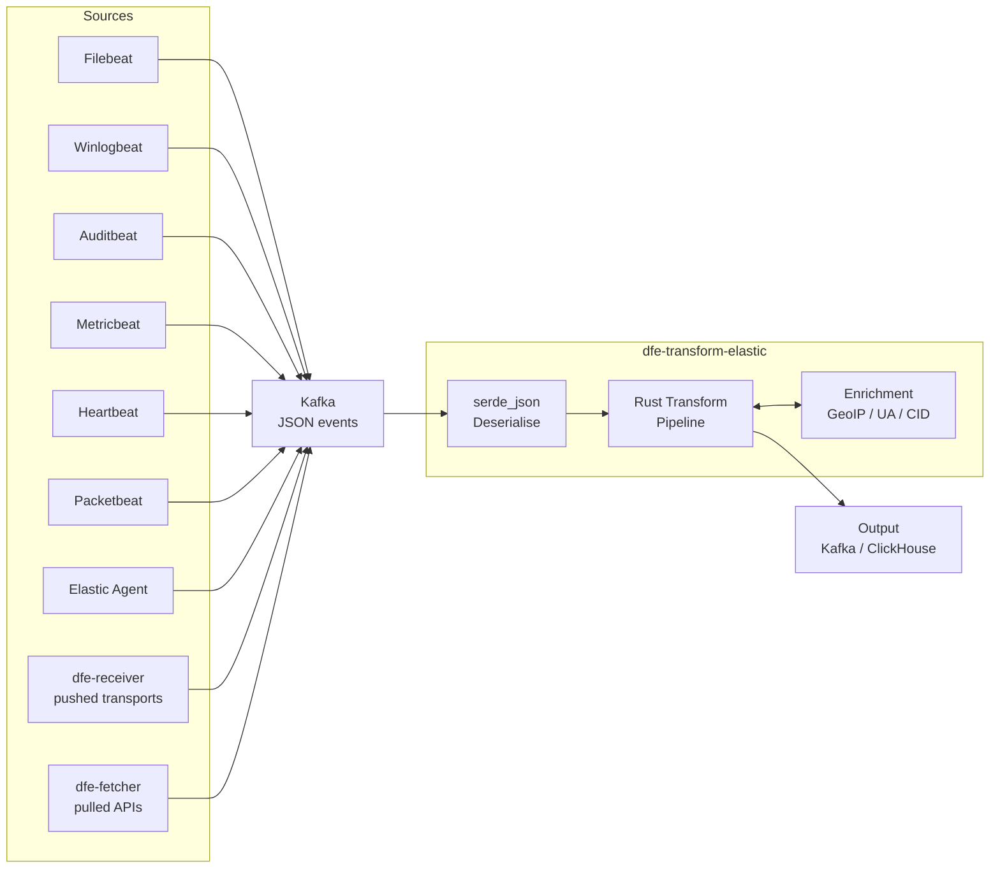
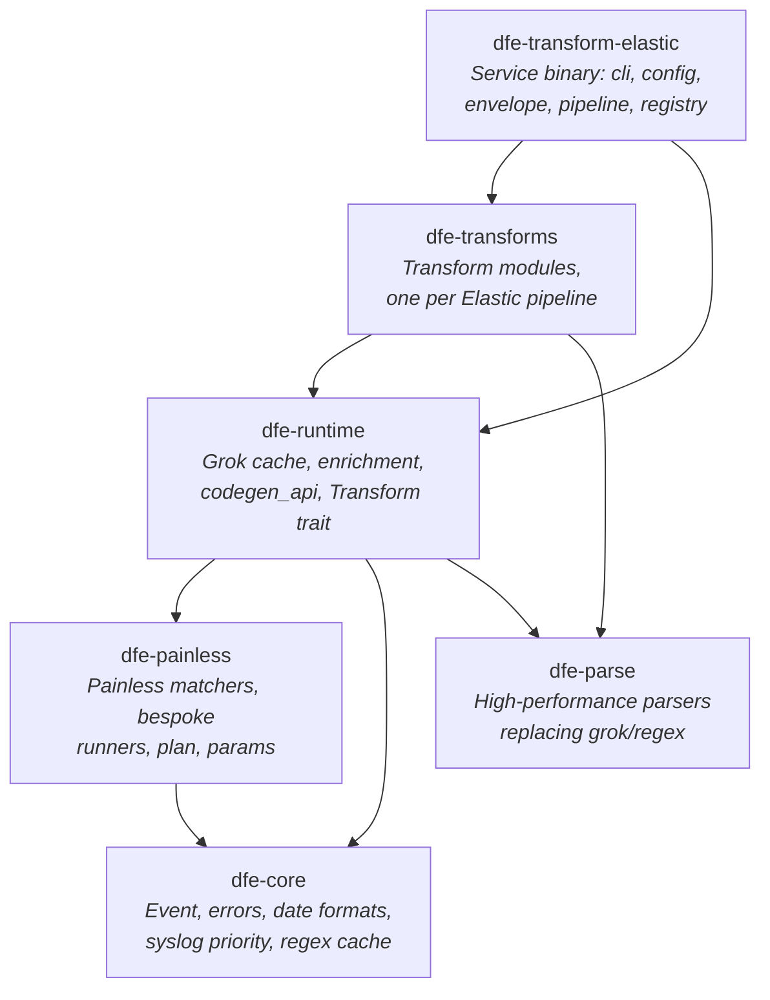
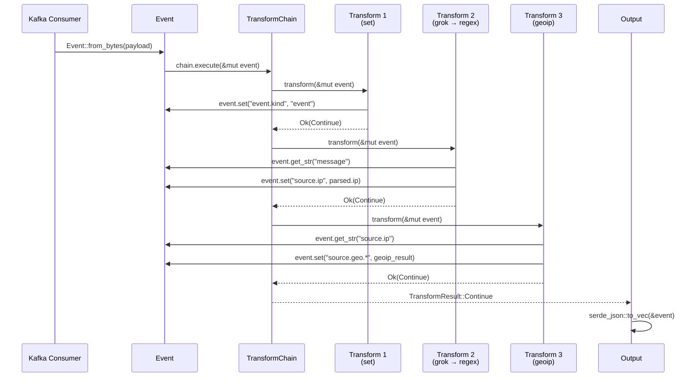
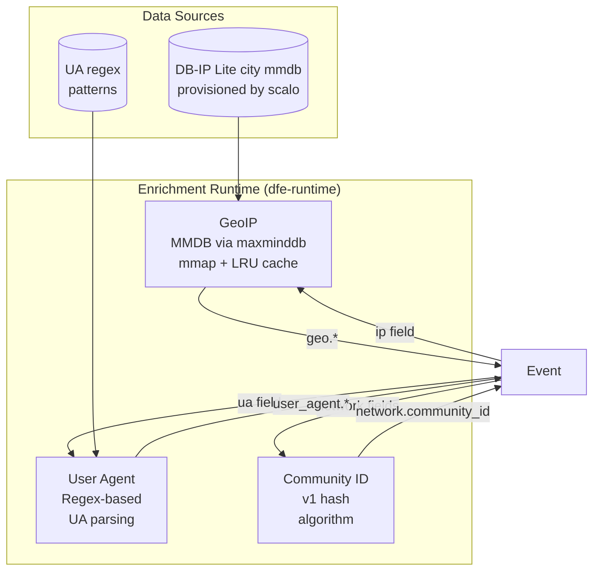
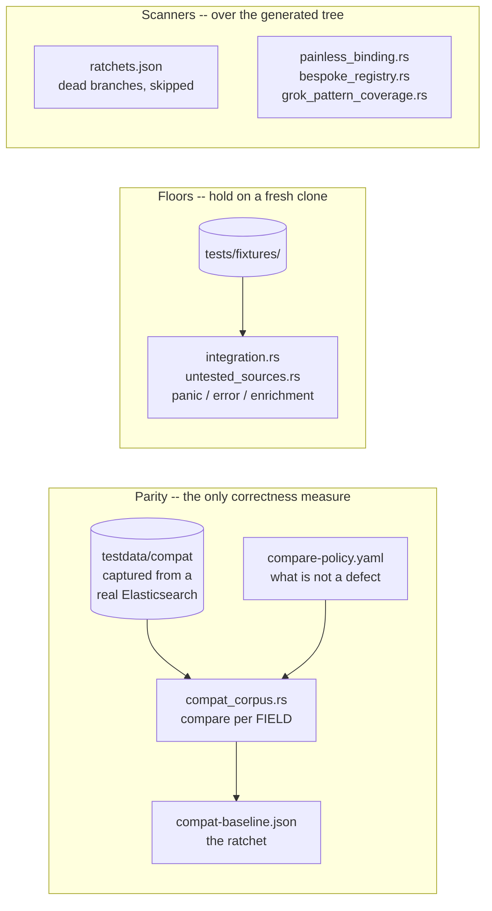

# Architecture Design

**Project:** dfe-transform-elastic
**Purpose:** Rust-optimised transform service for Elastic Stack data (Beats + Elastic Agent) ingested via Kafka

Converts Elastic ingest pipeline logic (Painless scripts + processors) into compiled Rust
transform functions, one module per source. There is no interpreter, no scripting VM and no
plugin system: the service resolves a source name to a compiled transform at startup, and the
hot path carries no dynamic dispatch per event.

---

## Parity Design Principle

**Goal:** Reliable 1:1 (or better) parity with Elastic ingest pipeline output for all
supported Beats and Elastic Agent integrations.

This is NOT reverse engineering Elasticsearch. We are building an independent transform
service that produces the same normalised ECS output as the Elastic ingest pipeline would.
Customers sending Beats/Agent data through DFE should get identical field mapping, type
coercion, and enrichment as if the data went directly to Elasticsearch.

**"Or better" means:** Where Elastic pipelines have known limitations (regex-only parsing,
single-threaded Painless execution, per-document GeoIP lookups), we can exceed their
performance while maintaining output compatibility.

### What We Replicate

The Elastic ingest pipeline is the primary transform layer. Data arrives from Beats/Agent
as JSON events, and the ingest pipeline applies processors sequentially to normalise,
enrich, and route the data.

| Elastic Component | dfe-transform-elastic Equivalent | Status |
|-------------------|----------------------------------|--------|
| **Ingest processors** (27 used) | Rust processor implementations, one per Elastic processor type | Done |
| **Painless scripts** | A hand-transcribed runner from `crates/dfe-painless/src/bespoke/` where one is registered for that script, otherwise pattern-matched against `params.rs` and the ladder in `common.rs`; unrecognised scripts are skipped | see Painless Coverage -- the figure is a corpus-run output, not a constant, so re-derive it rather than quoting one from here |
| **Foreach processor** | Per-event loop inside the transform function | Okta, O365 |
| **Pipeline chaining** | A nested pipeline is INLINED into the calling module between `// Begin nested pipeline` / `// End nested pipeline` markers, so there is no call and no dispatch on the hot path | Done. `rg -c "Begin nested pipeline" crates/dfe-transforms/src/` counts today's call sites |
| **GeoIP enrichment** | Global MMDB enricher, auto-detected at startup, LRU-cached | Done (DB-IP Lite) |
| **User Agent parsing** | Regex-based parser | Done (minor diffs from Elastic UA parser) |
| **Community ID** | Hash-based network flow ID | Done |
| **Conditional evaluation** | Native Rust `if`/`match` expressions per condition pattern | Nearly. A condition the transpiler cannot read emits `if false`, making the processor it guards dead code -- `skipped_processors` in `tests/ratchets.json` is the live count, with a per-source table beside it |
| **On-failure handlers** | Wrapped around EVERY processor by the generator, alongside `if` and `ignore_failure`, so a new processor cannot quietly omit them. A raised error runs the handlers and records `_ingest.on_failure_message` and `_ingest.on_failure_processor_type` | Done |

### What We Do NOT Replicate

| Elastic Component | Why Not | Our Approach |
|-------------------|---------|--------------|
| Beat/Agent collection | We receive from Kafka, not from endpoints | Upstream responsibility |
| Transport parsing (syslog, CEF) | Done by Beat/Agent, or by dfe-receiver for the syslog envelope | Upstream responsibility |
| Agent-side processors (`add_host_metadata`, `add_cloud_metadata`) | Run on source machine | Fields arrive pre-populated in event |
| `@custom` pipelines | User-specific, not part of integration | Not applicable |
| `final_pipeline` | Elasticsearch-specific routing | Not applicable |
| `enrich` processor | Requires Elasticsearch enrich index | Alternative enrichment via dfe-loader |
| `inference` processor | ML model execution | Not applicable for DFE |
| `reroute` processor | Elasticsearch index routing | Kafka topic routing instead |

The Beat or Agent collects raw data, adds host/cloud metadata, applies its own local
processors and JSON-encodes the result before it ever reaches Kafka (see System Context
below for the full flow). Everything from there is this service's job: JSON parse, ingest
pipeline logic, enrichment, ECS normalisation.

### Parity Verification

**Parity is measured ONLY against the compat corpus.**
`crates/dfe-transforms/tests/compat_corpus.rs` compares per FIELD against output captured from a
real Elasticsearch and ratchets `tests/compat-baseline.json`, which holds every per-source score.
`docs/COMPAT.md` is the full account: how the corpus is generated, what `tests/compare-policy.yaml`
excludes and why, and how the ratchet refuses to be lowered.

The `.log` / `-expected.json` fixtures under `crates/dfe-transforms/tests/fixtures/` predate the
current pipelines and disagree with what Elasticsearch emits now, so **their parity assertions
are retired**. `integration/` and `untested_sources.rs` beside them still run them, as panic,
error and enrichment floors -- which is what holds on a fresh clone, where the corpus is
gitignored and absent.

Per-processor runtime status and code pattern: see Processor Taxonomy below.

---

## System Context

Where dfe-transform-elastic fits in the Data Fusion Engine pipeline:



**Input:** JSON events from Kafka in any of the three producer envelopes -- Beats-shaped, dfe-receiver's, or dfe-fetcher's
**Transform:** Elastic ingest pipeline logic expressed as native Rust
**Output:** Transformed, normalised events (to Kafka, ClickHouse via dfe-loader, or other sinks)

---

## Crate Dependency Graph

The workspace is five library crates plus the root service package.



| Crate | Type | Purpose |
|-------|------|---------|
| `dfe-transform-elastic` | Binary + Library | Service binary: CLI, config cascade, envelope unwrapping, registry lookup, batch pipeline, deployment artefact generation |
| `dfe-transforms` | Library | Transform modules per data source (`filebeat::<source>::<pipeline>`) |
| `dfe-runtime` | Library | Grok caching, enrichment, `codegen_api`, the Transform trait, and the prelude |
| `dfe-painless` | Library | Painless pattern matching: the `known_patterns` ladder, `plan`, `params`, `patterns.lock`, and `bespoke/` -- one module per source holding the scripts transcribed by hand, resolved by script hash ahead of every matcher |
| `dfe-core` | Library | `Event`, error types, date formats, syslog priority, the regex cache |
| `dfe-parse` | Library | Zero-copy parsers replacing grok/regex patterns |

`dfe-transforms` has no direct edge to `dfe-painless`. It reaches the matchers through
`dfe-runtime`, which re-exports every moved module at its old `painless_*` path -- which
is why the thousand generated modules did not change when the split landed.

`dfe-parse` is reached, but only for two whole-pattern forms: `grok_cache` dispatches
`^%{IPV4:f}$` and `^%{IPV4:a}:%{PORT:p}$` to it and falls back to the compiled regex for
everything else. The regex is no longer built per call either -- the `cached_grok!` and
`cached_regex!` macros hold a site-local `OnceLock`, deliberately rather than a shared
map, because a shared reader-count atomic bounces between cores once one transform thread
runs per partition. Widening what `dfe-parse` covers is future work; wiring it in at all
is not.

---

## Service Binary

`src/` is the Kafka-to-Kafka service that resolves a configured source name to one compiled
transform and runs it over every batch on the scalo runtime.

| Module | Responsibility |
|---|---|
| `main.rs` | Entry point, hands off to `cli.rs` |
| `cli.rs` | Subcommands: run the service, `sources` (list registered transforms), `emit-dockerfile`, `emit-chart`, `emit-compose`, `generate-artefacts`, `metrics-manifest` |
| `config.rs` | The service's config shape: `pipeline_name`, `source.*`, `sink.*`, `geoip`, read once at startup |
| `registry.rs` | Source name to `Transform` lookup, plus each source's `Intake` (which envelopes it accepts), `Framing` and dataset |
| `envelope.rs` | Detects which of the three producer families wrapped an event and unwraps it into the shape every transform expects |
| `pipeline.rs` | Batch processing: NDJSON parse, envelope unwrap, transform, serialise, with per-batch outcome counts |
| `service.rs` | Wires the scalo Kafka consumer/producer to `pipeline.rs`, and owns the send/commit semantics below |
| `deployment.rs` | The single deployment contract: Dockerfile, Helm chart, compose fragment and KEDA scaler are all generated from here. Its tests pin the Dockerfile, `config.example.yaml`, the chart's `config:` block and the `docs/` config artefacts against a fresh regen -- not every artefact, see the README |
| `metrics.rs` | Metric definitions registered with scalo's `MetricsManager` |
| `error.rs` | The service's top-level error type |

A config naming a source the build does not carry is rejected at startup, not discovered at
the first batch. Nothing is hot-reloaded: `Config::load` reads the configuration once and the
loaded value is handed to the batch loop by reference, so every value needs a restart. The two
ways in also differ -- with no `--config` the scalo cascade applies and `DFE_TRANSFORM_ELASTIC_*`
overrides the files, while `--config` reads the named file directly and no such variable reaches
it. `src/config.rs` states both at the top of the file.

### Envelopes: the same pipeline, a different wrapper

`source.envelope` selects `auto` (the default), `beats`, `receiver` or `fetcher`.

- **beats** — the raw vendor payload as a string in `message`, which is what the transforms are
  written for, and what Elastic Agent and anything passing a Beats document through unaltered
  also produce.
- **receiver** — [dfe-receiver](https://github.com/hyperi-io/dfe-receiver)'s JSON on any of its
  transports. The syslog arm rebuilds a line into `message`; the rest pass their payload through
  with their own field names moved onto the ECS paths those names would otherwise shadow.
- **fetcher** — [dfe-fetcher](https://github.com/hyperi-io/dfe-fetcher)'s JSON, the provider's
  own payload at the top level, for the sources where Elastic's agent input is a pure transport.

`auto` resolves the family PER EVENT rather than per batch: a scalo `WorkBatch` spans
partitions, so one batch can carry two producers' wrappers and reading only its first event
unwrapped every one of them the same way. The cost is a handful of top-level key checks against
an unwrap measured at 2,740 ns an event.

Two syslog framings, recorded per source in `registry.rs` as the `Framing` enum:

- **Body** — `panw.*` and `cisco_meraki` read `message` as CSV or key-value. The receiver's
  body goes through untouched; a prefixed header would corrupt the first field.
- **Line** — `fortinet`, `cisco_ios` and `cisco_nexus` grok the header out of `message`, so a
  line is put back: the receiver's `_raw` verbatim if present, otherwise an RFC 3164 line
  rebuilt from the parsed fields. Reconstruction is enough for `fortinet` (`<PRI>` only); it is
  not enough for `cisco_ios` (wants a source IP) or `cisco_nexus` (wants a sequence number),
  since the receiver keeps neither.

A PINNED envelope a source cannot arrive in is rejected at startup, checked against that
source's `Intake` — okta is pulled from an API, so it accepts `beats` and `fetcher` and refuses
`receiver`. `auto` cannot be checked that way, since there is no event yet, so the same
mismatch is counted per batch instead.

### Delivery: at-least-once, enforced by stopping

Kafka commits are **cumulative** — the highest offset per partition — so an uncommitted batch is
only replayed if nothing after it commits. The loop therefore stops on a send it cannot complete
rather than continuing to the next batch, whose commit would acknowledge the failed one. The
process exits, and the restarted consumer resumes from the last committed offset. scalo's
transport exposes no consumer seek, so stopping is the only way to keep the guarantee.

All four `SendResult` variants are handled, and three of them are not delivery:

| Variant | Meaning | Response |
|---|---|---|
| `Ok` | The broker accepted it | Count as delivered |
| `Backpressured` | The local producer queue is full | Retry, bounded backoff to ~25s |
| `Fatal` | The send failed | Retry, then stop uncommitted |
| `FilteredDlq` | An outbound filter wants DLQ routing | Refuse — this service has no DLQ |

Backpressure is the NORMAL response from a slow sink, so treating it as success would
acknowledge batches that were never written.

**A batch is not one Kafka record.** `pipeline.rs::serialise_chunks` splits the outbound NDJSON
by BYTE budget (`sink.max_message_bytes`, default 900 KB) against librdkafka's 1,000,000-byte
producer `message.max.bytes` default, which scalo does not override. At `batch_size: 20000` a
single concatenated record is tens of megabytes and no batch would ever produce. An event that
exceeds the whole budget on its own is dropped and counted on `events_oversize_total` — no
broker would take it, and retrying it blocks the partition.

Duplicates are the accepted cost: a batch that fails partway through replays the records that
already landed, so every downstream consumer must be idempotent.

---

## Event Lifecycle

From Kafka message bytes to transformed output:



---

## Event Model

The `Event` type wraps `serde_json::Value` with dotted-path navigation for ECS field access.


### Dotted-Path Access

All field access uses ECS-style dotted paths (e.g., `source.geo.city_name`). The `set()` method
auto-creates intermediate objects:

```rust
// Navigates into {"source": {"geo": {"city_name": ...}}}
event.get_str("source.geo.city_name")

// Creates {"source": {"geo": {}}} if missing, then sets city_name
event.set("source.geo.city_name", "Sydney")?;
```

### Design Decisions

- **`serde_json::Value` over custom types:** Simpler to implement, and the map underneath is an `IndexMap` because `preserve_order` is not optional here -- Elasticsearch's own ingest documents are insertion-ordered and parity rests on it. Typed structs can be layered on later for hot-path fields.
- **`from_bytes` uses `serde_json`, not simd-json:** measured on this workload and it is the faster of the two, because getting a `serde_json::Value` out of simd-json goes tape to serde deserializer to `Value`, which is strictly more work than parsing straight into the same tree. simd-json is a dev-dependency of `dfe-runtime` now, kept only for `benches/json_parse.rs`, which is the measurement. Re-run it before reopening this.
- **Dotted-path splitting:** Split on `.` with no escaping. ECS field names never contain dots within a single field segment.

---

## Transform Pipeline

How transforms compose and handle errors:


### Error Handling Strategy

Mirrors Elastic ingest pipeline semantics:

| Elastic Behaviour | Rust Implementation |
|---|---|
| `on_failure` block | Nested `TransformChain` executed on error |
| `ignore_failure: true` | Wrap in `.ok()` / `let _ =`, continue |
| No error handling | Propagate error, stop chain |
| `tag` on failure | `event.append("tags", "error_tag")` |

At the service boundary, `pipeline.rs::transform_batch_with` treats a transform error the same
way as a rejected envelope: the event is counted and left out of the batch output, and
processing continues with the next event. One malformed record cannot stall a partition.

### Transform Trait Contract

```rust
pub trait Transform: Send + Sync {
    /// Human-readable processor name (for error context)
    fn name(&self) -> &str;

    /// Apply transform to event, returning Continue or Drop
    fn transform(&self, event: &mut Event) -> Result<TransformResult>;
}
```

- **Object-safe:** `dyn Transform` for heterogeneous chains
- **`Send + Sync`:** Safe for concurrent use across threads
- **Infallible transforms** (set, remove, rename) still return `Result` for uniform error propagation

---

## Parser Architecture

Three-layer strategy for replacing grok/regex with native Rust, implemented in `dfe-parse`.
Layer 1 is WIRED, for the two whole-pattern forms `grok_cache::native_form` recognises;
everything else still falls back to the compiled regex the grok expands to. The dispatch table
below is the current state, and widening it is the gap this architecture exists to close.

```mermaid
flowchart TD
    input[Grok Pattern String] --> expand[Expand grok aliases<br/>%{IP} → regex]
    expand --> analyse{Analyse each<br/>capture group}

    analyse -->|All replaceable| l1[Layer 1: Native Parsers<br/>parse_ipv4, parse_int, etc.<br/><b>10-20x faster</b>]
    analyse -->|Some replaceable| l2[Layer 2: Composite<br/>Chain L1 parsers +<br/>literal separators<br/><b>10-15x faster</b>]
    analyse -->|Irreducibly complex| l3[Layer 3: DFA Fallback<br/>regex-automata pre-compiled<br/><b>2-5x faster</b>]

    l1 --> output[Structured fields]
    l2 --> output
    l3 --> output

    style l1 fill:#2d5,stroke:#1a3,color:#fff
    style l2 fill:#28a,stroke:#167,color:#fff
    style l3 fill:#a72,stroke:#841,color:#fff
```

### Layer 1: Common Pattern Replacements (`ip.rs`, `numeric.rs`, `string.rs`, `timestamp.rs`)

Zero-regex native Rust parsers for the 15 most common grok patterns:

| Grok Pattern | Rust Parser | Technique |
|---|---|---|
| `%{IPV4}` | `parse_ipv4()` | Octet validation, direct byte scan |
| `%{IPV6}` | `parse_ipv6()` | Colon-group parser |
| `%{IPORHOST}` | `parse_ip_or_host()` | Try IP first, fall back to hostname |
| `%{INT}` | `parse_int::<T>()` | Direct digit scan, generic over type |
| `%{NUMBER}` | `parse_number()` | Integer or float with optional exponent |
| `%{WORD}` | `take_word()` | Byte-level alphanumeric scan |
| `%{GREEDYDATA}` | `take_greedy()` | Return remaining slice (zero cost) |
| `%{TIMESTAMP_ISO8601}` | `parse_iso8601()` | Fixed-position field extraction |
| `%{SYSLOGTIMESTAMP}` | `parse_syslog_timestamp()` | Month lookup table + digit parse |
| `%{LOGLEVEL}` | `parse_loglevel()` | Case-insensitive keyword match |
| `%{QUOTEDSTRING}` | `take_quoted()` | memchr for quote, handle escapes |
| `%{HOSTNAME}` | `parse_hostname()` | Label-dot-label (RFC 1123) |
| `%{MAC}` | `parse_mac()` | Fixed 6-group hex parse |
| `%{URI}` | `parse_uri()` | scheme://authority/path?query#fragment |
| `%{UUID}` | `parse_uuid()` | Fixed 8-4-4-4-12 hex pattern |

**What is WIRED is a much smaller set than what exists.** The table above is
`dfe-parse`'s capability, not the dispatch. `grok_cache::native_form` recognises
whole-pattern forms only, and by design refuses a near-miss rather than guessing
at one — a pattern with literal text around its captures stays on the regex,
because the regex engine is good at exactly that. Three forms are dispatched
today:

| Pattern | Path | Measured |
|---|---|---|
| `^%{IPV4:f}$` | `dfe_parse::ip::parse_ipv4` | 29 ns against 214 ns |
| `^%{IPV4:a}:%{PORT:p}$` | the two chained | 47 ns against 208 ns |
| `%{GREEDYDATA:f}`, anchored or not | `split_once('\n')` | 11 ns against 1,098 ns |

The third reaches no parser at all: `line_anchored` makes it `(?m)^.*$` because
joni anchors to lines, so it captures the FIRST LINE and the native form is a
newline scan. It covers 202 call sites over 37 distinct patterns, 4.7% of the
4,299 grok sites in the generated tree (3,496 `cached_grok!` plus 803
`cached_grok_mapped!`).

Those are DERIVED, not typed: `.hyperi-ai/tmp/count_grok_sites.py` re-counts
them. The previous pair -- 194 sites, 10.2% of 1,906 -- was measured before the
tree was regenerated whole, and the share fell because the denominator more
than doubled, not because the native form lost ground.

`^%{DATA:f}$` is deliberately excluded despite reading the same: `%{DATA}` is
the lazy `.*?`, and on a `\r\n` line ending greedy keeps the `\r` in the capture
where lazy stops before it.

Every dispatched form carries an equivalence test running both paths over the
same inputs, because the native path is an optimisation over the regex and never
a replacement for it.

**Parser convention:** All parsers take `&str`, return `ParseResult<'_, T>` where
`T` is the parsed value (often `&str` for zero-copy):

```rust
pub type ParseResult<'a, T> = Result<(&'a str, T), ParseError>;
```

The return tuple contains `(remaining_input, parsed_value)`, following winnow/nom convention.

### Layer 2: Composite Parser Builder (`composite.rs`)

Chains Layer 1 parsers with literal separators for full grok-equivalent patterns:

```rust
// Grok: %{IPORHOST:source_ip}:%{INT:source_port} -> %{IPORHOST:dest_ip}:%{INT:dest_port}
// Becomes:
let parser = CompositeParser::builder()
    .capture("source_ip", parse_ip_or_host)
    .literal(":")
    .capture("source_port", parse_int::<u16>)
    .literal(" -> ")
    .capture("dest_ip", parse_ip_or_host)
    .literal(":")
    .capture("dest_port", parse_int::<u16>)
    .build();
```

### Layer 3: Pre-compiled DFA Fallback (`dfa.rs`)

For patterns that can't be decomposed into Layer 1/2:

- Compile regex to DFA at build time via `regex-automata`
- Serialise DFA bytes, load at runtime with zero compilation cost
- Named capture groups mapped to field names

### Performance Targets

| Operation | Regex/Grok | Native Rust | Expected Speedup |
|---|---|---|---|
| IP address parse | ~200ns | ~15ns | ~13x |
| Timestamp (ISO8601) | ~500ns | ~40ns | ~12x |
| Integer parse | ~100ns | ~10ns | ~10x |
| Syslog header (5 fields) | ~2us | ~100ns | ~20x |
| Full DNS log line (8 fields) | ~5us | ~300ns | ~15x |

JSON parsing is deliberately absent: it is not a grok replacement, and the one
candidate that would have belonged here lost its own benchmark
(`crates/dfe-runtime/benches/json_parse.rs`).

---

## Processor Taxonomy

Every processor the transforms use, by implementation weight, runtime status, and which
sources exercise it.

### Simple (~11) — direct `Event` API calls, no parser dependency

| Processor | Status | Used By | Code Pattern |
|---|---|---|---|
| `set` | Done | All | `event.set(path, value)?` |
| `append` | Done | All | `event.append(path, value)?` |
| `remove` | Done | All | `event.remove(path)` |
| `rename` | Done | All | `event.rename(from, to)?` |
| `uppercase` | Done | Panw | `event.set(path, s.to_uppercase())?` |
| `lowercase` | Done | All | `event.set(path, s.to_lowercase())?` |
| `trim` | Done | Cisco | `event.set(path, s.trim())?` |
| `convert` | Done | All | Type coercion: `str→i64`, `str→f64`, `i64→str` |
| `drop` | Done | All | `return Ok(TransformResult::Drop)` |
| `split` | Done | O365 | `event.set(path, s.split(sep).collect())?` |
| `join` | Done | SentinelOne | `join_values(value, sep)`, `None` on a non-array |
| `uri_parts` | Done | Panw | Scheme, host, port, path, query components |
| `dot_expander` | Done | GCP | `dot_expand(event, path, field)` |
| `fail` | Done | CrowdStrike | Returns a `TransformError` carrying the message |
| `terminate` | Done | Defender | Stops the pipeline and KEEPS the document |
| `urldecode` | Done | Zscaler | `url_decode`, form-encoded so `+` is a space |
| `sort` | Done | M365 Defender | `sort_values`, errors on anything with no natural ordering |

### Medium (~8) — read a field value and reshape it

| Processor | Status | Used By | Code Pattern |
|---|---|---|---|
| `grok` | Done (regex fallback) | All | `grok_to_regex` builds a pattern, `regex::Regex` matches it |
| `dissect` | Done | Cisco, Meraki | Tokenizer-based split parser |
| `json` | Done | All | `codegen_api::parse_json_str`, on `serde_json` |
| `kv` | Done | Okta | Key-value split, configurable delimiters |
| `csv` | Done | Fortinet | Separator/quote config |
| `foreach` | Done | Okta, O365, sysmon | Each element bound to `_ingest._value`, the inner processor run, the list rebuilt |
| `date` | Done | All | `chrono` against the formats a source emits |
| `gsub` | Done | O365 | `regex::Regex::replace_all` |

### Complex (~8) — enrichment runtime or a Painless pattern match

| Processor | Status | Used By | Code Pattern |
|---|---|---|---|
| `script` (Painless) | Pattern-match, see below | All | Rust matching a recognised script pattern, or a no-op |
| `geoip` | Done (DB-IP) | All with IPs | `enrichment::geoip::enrich(event, field, prefix)?` |
| `user_agent` | Done | O365, Okta | `enrichment::user_agent::enrich(event, field, prefix)?` |
| `community_id` | Done | Panw, Fortinet | `enrichment::community_id::enrich(event)?` |
| `registered_domain` | Done | Panw | Split heuristic (full public suffix list deferred) |
| `network_direction` | Done | Fortinet, Panw | CIDR-based internal/external classification |
| `fingerprint` | Done | O365, M365 | `fingerprint_default`: SHA-1, base64, NUL before each value. `salt` and `method` are refused, so the default is the only path. |
| `pipeline` (nested) | Done | most multi-pipeline packages -- derive with `rg -l "Begin nested pipeline"` | Inlined into the caller, not a call |

Not implemented (not used by any vendored pipeline): bytes, cef, date_index_name,
enrich, geo_grid, html_strip, inference, redact, reroute, set_security_user.
The generator ERRORS on one rather than skipping it, so a package that starts
using one fails to onboard and says which -- that is how `join`, `sort`,
`urldecode`, `dot_expander`, `fail` and `terminate` got written.

### Painless Coverage

A script the runtime cannot execute is skipped rather than failing the event, so the skips have
to be counted or they are indistinguishable from a script that did nothing. `painless_exec`
lives in `crates/dfe-painless/src/plan.rs` and is re-exported through
`crates/dfe-runtime/src/codegen_api.rs` for the generated call sites. It resolves a
hand-transcribed runner from `crates/dfe-painless/src/bespoke/` first, then the params patterns
in `params.rs`, then the `known_patterns` ladder in `common.rs`, and records the outcome
through `crates/dfe-painless/src/stats.rs`.

**Two measurements, and only the second is honest about reach.**

`crates/dfe-transforms/tests/painless_coverage.rs` drives the committed fixtures and holds a
floor of 100%, none skipped. That floor is real but its driver is narrow -- a few dozen fixture
files against the compat corpus's several hundred data streams -- so it says the fixtures are
fully covered, not that the runtime is.

Running the same counters over the compat corpus is what says that. Both figures are run
outputs rather than constants, so derive them rather than quoting a number from here: the
corpus run prints handled, skipped and distinct-script counts, `never_ran` is ratcheted in
`tests/compat-baseline.json`, and `DFE_PAINLESS_UNHANDLED=<path>` on the corpus test writes the
per-script detail.

The gap between the two is the point. A pattern can MATCH a script statically and then decline at
run time, which reads as covered from everywhere except that dump - so
`scripts/pattern_reach.py` joins it against the static census
(`DFE_BINDING_DUMP=<path>` on `painless_binding`) to name the patterns that claim a script and
never apply it.

---

## Enrichment Architecture

Runtime enrichment modules loaded once, shared across transforms:



### Enrichment Trait

```rust
pub trait Enrichment: Send + Sync {
    fn enrich(&self, event: &mut Event) -> Result<()>;
}
```

### GeoIP Design

- **Provisioning:** the config's `geoip` section is scalo's `GeoIpConfig` verbatim, because provisioning is shared across the fleet while the lookup engine and its cache stay in `dfe-runtime`. It defaults to ENABLED with auto-download from DB-IP Lite, so an operator gets databases without configuring anything, and it is read once at startup.
- **Storage:** mmap'd MMDB via `maxminddb` crate (zero-copy read)
- **Cache:** an LRU cache in front of the MMDB reader (`crates/dfe-runtime/src/enrichment/geoip_cache.rs`), 100,000 entries by default, a quarter evicted at a time when full. 325 of the 1,069 generated data-stream modules carry a geoip call, 2,953 call sites between them, so a single 20k-event batch can hit the cache several times per event. Re-derive both counts by scanning `crates/dfe-transforms/src/filebeat/` rather than trusting these -- the previous pair, "14 of the 60 source pipelines", predated most of the tree.
- **Output fields:** `country_name`, `country_iso_code`, `city_name`, `location.lat`, `location.lon`, `continent_name`, `timezone`
- **Failure:** `ignore_missing` support, errors tagged not fatal

### User Agent Design

- **Parser:** Regex-based UA string parsing
- **Output fields:** `name`, `version`, `os.name`, `os.version`, `device.name`, `device.type`

### Community ID Design

- **Algorithm:** Community ID v1 (SHA-1 based network flow hash)
- **Input fields:** `source.ip`, `destination.ip`, `source.port`, `destination.port`, `network.transport`
- **Output:** `network.community_id` (e.g., `1:LQU9qZlK+B5F3KDmev6m5PMibrg=`)

---

## Testing Strategy

Three tracks, and only the first measures parity.



The corpus is GITIGNORED, so it exists only where it has been generated. Its absence makes
`compat_corpus.rs` pass, which is why a run outside the main tree needs `DFE_COMPAT_CORPUS`
pointed at one.

### Match Modes

`crates/dfe-runtime/src/testutil/diff.rs` defines `MatchMode`:

| Mode | Use Case | Behaviour |
|---|---|---|
| **Exact** | Default | Field-for-field JSON match |
| **Semantic** | Non-deterministic fields | Ignore timestamps with "now", generated UUIDs, GeoIP, user agent |
| **Subset** | Fields set by Beats runtime | Expected is subset of actual (extra fields OK) |

### Non-English Input

`tests/unicode.rs` runs every registered transform against seventeen scripts and a set of
degenerate inputs, so multi-byte and malformed text is a first-class case rather than an edge
case discovered in production.

### Benchmark Framework

- **Per-parser:** Criterion benchmarks comparing each dfe-parse parser against its regex equivalent (`crates/dfe-parse/benches/parsers.rs`)
- **End-to-end:** Full pipeline (JSON deserialise → transform chain → serialise)

---

## Performance Architecture

### SIMD Acceleration

| Library | Use | SIMD Features |
|---|---|---|
| `memchr` | Delimiter scanning in parsers (`string.rs`) | AVX2/SSE2 byte search |
| `regex-automata` | Layer 3 DFA fallback (`dfa.rs`) | Compiled DFA (no backtracking) |

JSON deserialisation is NOT on this list. simd-json was measured against
`serde_json` on this workload and lost on both paths -- see the Event Model
above.

Build targets in `.cargo/config.toml`:
- **x86_64 release:** `-C target-cpu=x86-64-v3` (AVX2, BMI1/2, FMA — Haswell+)
- **aarch64 release:** `-C target-cpu=generic` (NEON baseline)
- **Development:** `-C target-cpu=native`

### Zero-Copy Patterns

1. **Kafka → Event:** `Event::from_bytes` borrows from the message buffer rather than copying it
2. **Parser returns:** `ParseResult<'a, &'a str>` — parsed values reference input slice
3. **Field access:** `event.get_str()` returns `Option<&str>` borrowing from inner Value
4. **Cow for transforms:** `Cow<'_, str>` when field may or may not need modification

### Buffer Reuse

- Pre-allocated `Vec<u8>` buffers for serialisation output
- `String` buffers cleared and reused across events for format operations
- `Vec::with_capacity()` based on expected batch sizes

### Release Profile

```toml
[profile.release]
lto = "thin"
codegen-units = 1
panic = "abort"
strip = true
opt-level = 3
```

---

## Future: dfe-parsers — Standalone Parser Crate

**Vision:** extract the per-source message-parsing logic in `dfe-transforms`, plus `dfe-parse`
itself, into a standalone `dfe-parsers` crate that any DFE Rust project can depend on. It would
take `&str` / `Value` input and return structured output with no knowledge of Beats, Elastic
Agent, or transport, so a syslog feed project outside this repo could parse a raw line and get
the same structured output as if it had come through Beats.

`dfe-transforms` would become a thin layer over it: Beats/Agent envelope handling, ECS field
naming, and the enrichment calls, with the actual message parsing delegated out. This project
is the pilot: the per-source parsing logic is already written to be crate-independent, operating
on `&str` / `Value` with no transport coupling, so it can be extracted once proven.

---

## Appendix: Key Dependencies

| Crate | Version | Purpose |
|---|---|---|
| `serde` / `serde_json` | >=1.0 | Serialisation framework, and both JSON paths. `preserve_order` is on, so object keys keep document order |
| `simd-json` | >=0.14, <0.15 | DEV-dependency of `dfe-runtime` only, for `benches/json_parse.rs` -- the bench that demoted it |
| `serde_yaml_ng` | >=0.10 | YAML config parsing |
| `memchr` | >=2.7 | SIMD byte search (`crates/dfe-parse/src/string.rs`) |
| `regex-automata` | >=0.4 | Pre-compiled DFA regex (`crates/dfe-parse/src/dfa.rs`) |
| `regex` | >=1.10 | Grok-derived pattern matching in `dfe-transforms` |
| `fancy-regex` | >=0.13 | Backtracking fallback for the vendor patterns `regex` rejects by design -- lookaround and backreferences. Reached only when `regex` fails to COMPILE, so the hot path is unchanged |
| `psl` | >=2.1 | Mozilla's Public Suffix List, compiled in, for `registered_domain` |
| `parking_lot` | >=0.12.5, <0.13 | The lock in front of the GeoIP cache, taken per event across one transform thread per partition |
| `chrono` | >=0.4 | Timestamp handling |
| `maxminddb` | >=0.27, <0.28 | GeoIP lookups (mmap, simdutf8) |
| `rustc-hash`, `sha1`, `sha2`, `base64` | latest majors | Fingerprinting and Community ID hashing |
| `url` | >=2.5 | URL parsing (`uri_parts`) |
| `csv` | >=1.3 | CSV processor |
| `scalo` | >=2.11.1, <3 | Config, logging, metrics, Kafka transport, deployment, memory guard, scaling — the service binary's runtime |
| `clap` | >=4.5 | Service CLI surface |
| `tokio` | >=1.48 | Async runtime |
| `thiserror` | >=2.0 | Error types in every crate, including the service binary's `src/error.rs` |
| `anyhow` | >=1.0 | Error handling inside `dfe-runtime` and `dfe-transforms` |
| `tracing` | >=0.1 | Logging |
| `criterion` | >=0.5, <0.6 | Benchmarking framework |
| `testcontainers` | >=0.27, <0.28 | Ephemeral Kafka broker for round-trip tests |
