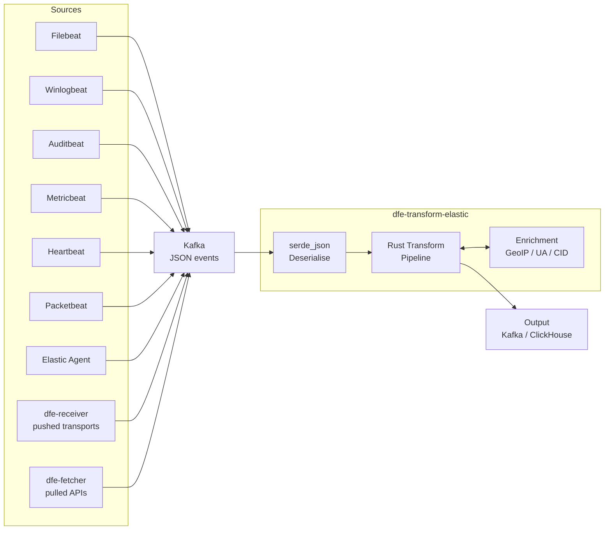
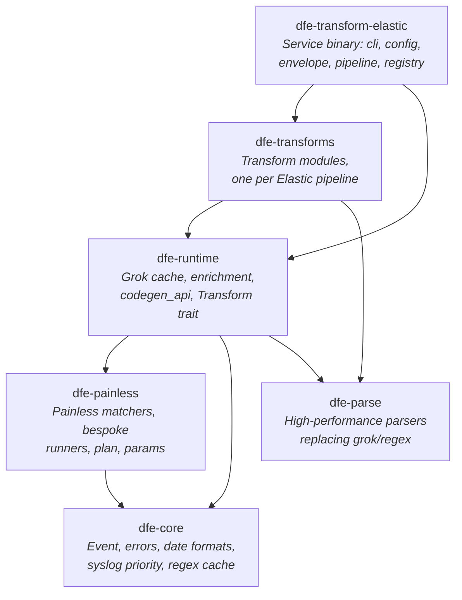
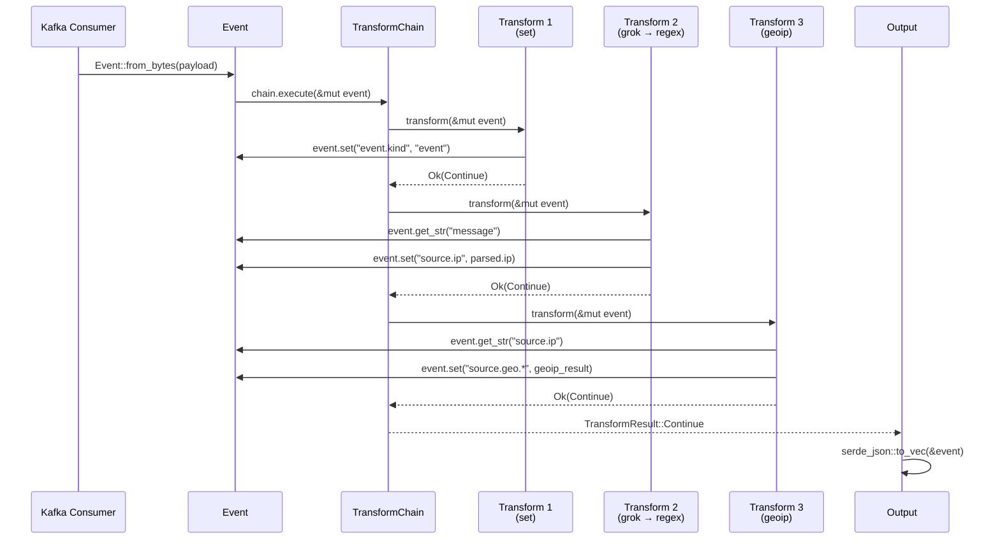
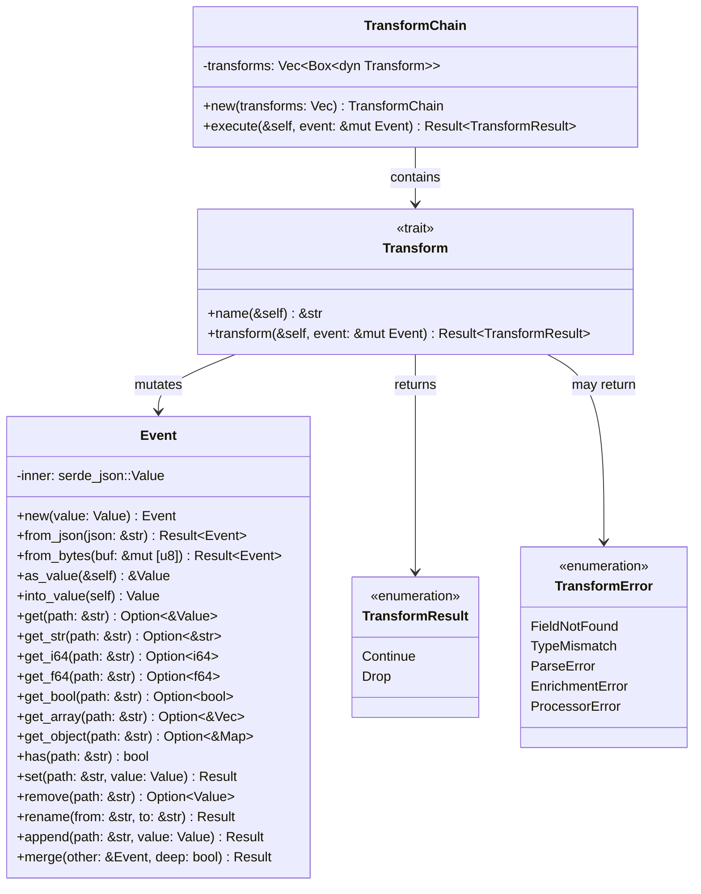
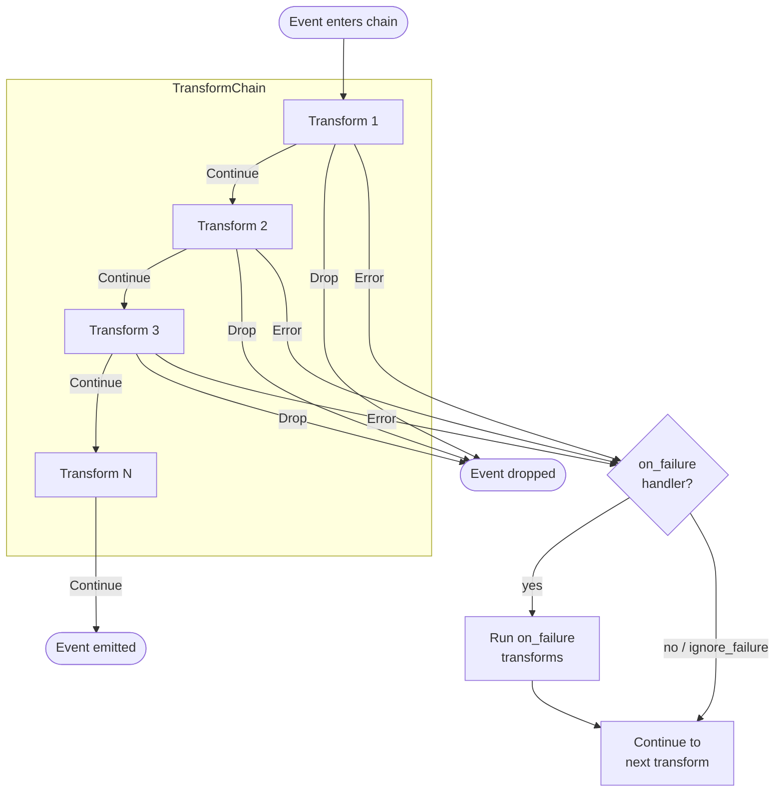

# Architecture

**Project:** dfe-transform-elastic
**Purpose:** Rust-optimised transform service for Elastic Stack data (Beats + Elastic Agent) ingested via Kafka

Converts Elastic ingest pipeline logic (Painless scripts + processors) into compiled Rust
transform functions, one module per source. There is no interpreter, no scripting VM and no
plugin system: the service resolves a source name to a compiled transform at startup, and the
hot path carries no dynamic dispatch per event.

This page is the code map: where the service sits, what the crates are, what the binary does,
and what an event is on the way through. The neighbouring pages carry the rest --
[parity.md](parity.md), [parsers.md](parsers.md), [enrichment.md](enrichment.md),
[testing.md](testing.md) and [performance.md](performance.md).

---

## System context

Where dfe-transform-elastic fits in the Data Fusion Engine pipeline:



**Input:** JSON events from Kafka in any of the three producer envelopes -- Beats-shaped, dfe-receiver's, or dfe-fetcher's
**Transform:** Elastic ingest pipeline logic expressed as native Rust
**Output:** Transformed, normalised events (to Kafka, ClickHouse via dfe-loader, or other sinks)

---

## Crate dependency graph

The workspace is five library crates plus the root service package.



| Crate | Type | Purpose |
|-------|------|---------|
| `dfe-transform-elastic` | Binary + Library | Service binary: CLI, config cascade, envelope unwrapping, registry lookup, batch pipeline, deployment artefact generation |
| `dfe-transforms` | Library | Transform modules per data source (`filebeat::<source>::<pipeline>`) |
| `dfe-runtime` | Library | Grok caching, enrichment, `codegen_api`, the Transform trait, and the prelude |
| `dfe-painless` | Library | Painless pattern matching: the `known_patterns` ladder, `plan`, `params`, `patterns.lock`, and `bespoke/` -- one module per source holding the scripts transcribed by hand, resolved by script hash ahead of every matcher |
| `dfe-core` | Library | `Event`, error types, date formats, syslog priority, the regex cache |
| `dfe-parse` | Library | Zero-copy parsers replacing grok/regex patterns |

`dfe-transforms` has no direct edge to `dfe-painless`. It reaches the matchers through
`dfe-runtime`, which re-exports every moved module at its old `painless_*` path -- which
is why the thousand generated modules did not change when the split landed.

`dfe-parse` is reached, but only for two whole-pattern forms: `grok_cache` dispatches
`^%{IPV4:f}$` and `^%{IPV4:a}:%{PORT:p}$` to it and falls back to the compiled regex for
everything else. The regex is no longer built per call either -- the `cached_grok!` and
`cached_regex!` macros hold a site-local `OnceLock`, deliberately rather than a shared
map, because a shared reader-count atomic bounces between cores once one transform thread
runs per partition. Widening what `dfe-parse` covers is future work; wiring it in at all
is not.

The third-party libraries underneath all six crates are
[Key dependencies](performance.md#key-dependencies).

---

## Service binary

`src/` is the Kafka-to-Kafka service that resolves a configured source name to one compiled
transform and runs it over every batch on the scalo runtime.

| Module | Responsibility |
|---|---|
| `main.rs` | Entry point, hands off to `cli.rs` |
| `cli.rs` | Subcommands: run the service, `sources` (list registered transforms), `emit-dockerfile`, `emit-chart`, `emit-compose`, `generate-artefacts`, `metrics-manifest` |
| `config.rs` | The service's config shape: `pipeline_name`, `source.*`, `sink.*`, `geoip`, read once at startup, and `CASCADE_ONLY_SECTIONS` -- the scalo sections a `--config` file is refused for carrying |
| `registry.rs` | Source name to `Transform` lookup, plus each source's `Intake` (which envelopes it accepts), `Framing` and dataset |
| `envelope.rs` | Detects which of the three producer families wrapped an event and unwraps it into the shape every transform expects |
| `pipeline.rs` | Batch processing: NDJSON parse, envelope unwrap, transform, serialise, with per-batch outcome counts |
| `service.rs` | Wires the scalo Kafka consumer/producer to `pipeline.rs`, and owns the send/commit semantics below |
| `deployment.rs` | The single deployment contract: Dockerfile, Helm chart, compose fragment and KEDA scaler are all generated from here. Its tests pin the Dockerfile, `config.example.yaml`, the chart's `config:` block and the `docs/` config artefacts against a fresh regen -- not every artefact, see the README |
| `metrics.rs` | Metric definitions registered with scalo's `MetricsManager` |
| `error.rs` | The service's top-level error type |

A config naming a source the build does not carry is rejected at startup, not discovered at
the first batch. Nothing is hot-reloaded: `Config::load` reads the configuration once and the
loaded value is handed to the batch loop by reference, so every value needs a restart. The two
ways in also differ -- with no `--config` the scalo cascade applies and `DFE_TRANSFORM_ELASTIC_*`
overrides the files, while `--config` reads the named file directly and no such variable reaches
it. `src/config.rs` states both at the top of the file.

**Scaling is configured through the environment, not the config file.** The container is started
with `--config`, and scalo resolves `scaling` from its own cascade -- `./defaults.yaml`,
`./settings.yaml`, `/config/settings.yaml`, then `DFE_TRANSFORM_ELASTIC_*` -- so a file named on
the command line reaches it through no layer at all. Set
`DFE_TRANSFORM_ELASTIC_SCALING__ENABLED` or
`DFE_TRANSFORM_ELASTIC_SCALING__MEMORY_GATE_THRESHOLD`; the effective values are logged once at
startup, with the layer that supplied them. The same holds for every section in
`config::CASCADE_ONLY_SECTIONS`, and `Config::load` refuses one in a `--config` file rather than
ignoring it -- a block that changes nothing is worse than no block. `geoip` is the exception
that proves the rule: it is declared on `Config` and handed to scalo explicitly, so a file may
set it.

KEDA replica scaling is separate and unaffected -- it is Kubernetes-side, driven by the chart's
`keda.*` values and the `scaling_pressure` gauge.

## Envelopes: the same pipeline, a different wrapper

`source.envelope` selects `auto` (the default), `beats`, `receiver` or `fetcher`.

- **beats** — the raw vendor payload as a string in `message`, which is what the transforms are
  written for, and what Elastic Agent and anything passing a Beats document through unaltered
  also produce.
- **receiver** — [dfe-receiver](https://github.com/hyperi-io/dfe-receiver)'s JSON on any of its
  transports. The syslog arm rebuilds a line into `message`; the rest pass their payload through
  with their own field names moved onto the ECS paths those names would otherwise shadow.
- **fetcher** — [dfe-fetcher](https://github.com/hyperi-io/dfe-fetcher)'s JSON, the provider's
  own payload at the top level, for the sources where Elastic's agent input is a pure transport.

`auto` resolves the family PER EVENT rather than per batch: a scalo `WorkBatch` spans
partitions, so one batch can carry two producers' wrappers and reading only its first event
unwrapped every one of them the same way. The cost is a handful of top-level key checks against
an unwrap measured at 2,740 ns an event.

Two syslog framings, recorded per source in `registry.rs` as the `Framing` enum:

- **Body** — `panw.*` and `cisco_meraki` read `message` as CSV or key-value. The receiver's
  body goes through untouched; a prefixed header would corrupt the first field.
- **Line** — `fortinet`, `cisco_ios` and `cisco_nexus` grok the header out of `message`, so a
  line is put back: the receiver's `_raw` verbatim if present, otherwise an RFC 3164 line
  rebuilt from the parsed fields. Reconstruction is enough for `fortinet` (`<PRI>` only); it is
  not enough for `cisco_ios` (wants a source IP) or `cisco_nexus` (wants a sequence number),
  since the receiver keeps neither.

A PINNED envelope a source cannot arrive in is rejected at startup, checked against that
source's `Intake` — okta is pulled from an API, so it accepts `beats` and `fetcher` and refuses
`receiver`. `auto` cannot be checked that way, since there is no event yet, so the same
mismatch is counted per batch instead.

## Delivery: at-least-once, enforced by stopping

Kafka commits are **cumulative** — the highest offset per partition — so an uncommitted batch is
only replayed if nothing after it commits. The loop therefore stops on a send it cannot complete
rather than continuing to the next batch, whose commit would acknowledge the failed one. The
process exits, and the restarted consumer resumes from the last committed offset. scalo's
transport exposes no consumer seek, so stopping is the only way to keep the guarantee.

All four `SendResult` variants are handled, and three of them are not delivery:

| Variant | Meaning | Response |
|---|---|---|
| `Ok` | The broker accepted it | Count as delivered |
| `Backpressured` | The local producer queue is full | Retry, bounded backoff to ~25s |
| `Fatal` | The send failed | Retry, then stop uncommitted |
| `FilteredDlq` | An outbound filter wants DLQ routing | Refuse — this service has no DLQ |

Backpressure is the NORMAL response from a slow sink, so treating it as success would
acknowledge batches that were never written.

**A batch is not one Kafka record.** `pipeline.rs::serialise_chunks` splits the outbound NDJSON
by BYTE budget (`sink.max_message_bytes`, default 900 KB) against librdkafka's 1,000,000-byte
producer `message.max.bytes` default, which scalo does not override. At `batch_size: 20000` a
single concatenated record is tens of megabytes and no batch would ever produce. An event that
exceeds the whole budget on its own is dropped and counted on `events_oversize_total` — no
broker would take it, and retrying it blocks the partition.

Duplicates are the accepted cost: a batch that fails partway through replays the records that
already landed, so every downstream consumer must be idempotent.

---

## Event lifecycle

From Kafka message bytes to transformed output:



---

## Event model

The `Event` type wraps `serde_json::Value` with dotted-path navigation for ECS field access.



### Dotted-path access

All field access uses ECS-style dotted paths (e.g., `source.geo.city_name`). The `set()` method
auto-creates intermediate objects:

```rust
// Navigates into {"source": {"geo": {"city_name": ...}}}
event.get_str("source.geo.city_name")

// Creates {"source": {"geo": {}}} if missing, then sets city_name
event.set("source.geo.city_name", "Sydney")?;
```

### Design decisions

- **`serde_json::Value` over custom types:** Simpler to implement, and the map underneath is an `IndexMap` because `preserve_order` is not optional here -- Elasticsearch's own ingest documents are insertion-ordered and parity rests on it. Typed structs can be layered on later for hot-path fields.
- **`from_bytes` uses `serde_json`, not simd-json:** measured on this workload and it is the faster of the two, because getting a `serde_json::Value` out of simd-json goes tape to serde deserializer to `Value`, which is strictly more work than parsing straight into the same tree. simd-json is a dev-dependency of `dfe-runtime` now, kept only for `benches/json_parse.rs`, which is the measurement. Re-run it before reopening this.
- **Dotted-path splitting:** Split on `.` with no escaping. ECS field names never contain dots within a single field segment.

---

## Transform pipeline

How transforms compose and handle errors:



### Error handling strategy

Mirrors Elastic ingest pipeline semantics:

| Elastic Behaviour | Rust Implementation |
|---|---|
| `on_failure` block | Nested `TransformChain` executed on error |
| `ignore_failure: true` | Wrap in `.ok()` / `let _ =`, continue |
| No error handling | Propagate error, stop chain |
| `tag` on failure | `event.append("tags", "error_tag")` |

At the service boundary, `pipeline.rs::transform_batch_with` treats a transform error the same
way as a rejected envelope: the event is counted and left out of the batch output, and
processing continues with the next event. One malformed record cannot stall a partition.

### Transform trait contract

```rust
pub trait Transform: Send + Sync {
    /// Human-readable processor name (for error context)
    fn name(&self) -> &str;

    /// Apply transform to event, returning Continue or Drop
    fn transform(&self, event: &mut Event) -> Result<TransformResult>;
}
```

- **Object-safe:** `dyn Transform` for heterogeneous chains
- **`Send + Sync`:** Safe for concurrent use across threads
- **Infallible transforms** (set, remove, rename) still return `Result` for uniform error propagation
