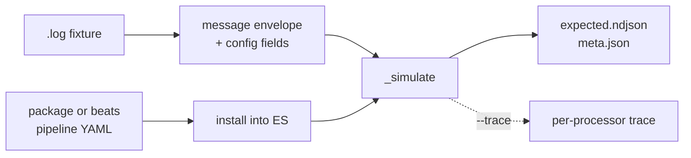

# compat -- confirmed output from the real Elastic engine

`scripts/compat.py` runs raw source data through Elastic's own ingest pipelines
in a throwaway Elasticsearch container and writes the resulting documents to
disk. Those documents are ground truth: what upstream actually produces, rather
than what we believe it produces.

Run it occasionally, when you need new ground truth. Everything downstream
reads the files it writes and needs no Docker.

This page is the how-to: what to install, what to run, and how to work a source.
What a difference MEANS -- the ratchet, the compare policy, and the divergences kept on
purpose -- is [compat-policy.md](compat-policy.md).



## Prerequisites

- Docker, and roughly 2 GB free for the Elasticsearch container.
- Clones of `elastic/integrations` and `elastic/beats` in one directory.
  Point at them with `DFE_ELASTIC_SOURCES` or `--sources`. There is no default.
- Python 3.12+ with PyYAML. No virtualenv, no project dependency.

Confirm all of it before starting a container:

```bash
scripts/compat.py check
```

### What still needs the clones

Only two things, and both are periodic:

- **Generating the corpus.** The pipelines are read from `elastic/integrations`
  at a named commit, which is the point -- an independent reading of what
  Elastic does now, rather than what our vendored pipeline copy says. That
  distinction has already earned itself: the corpus shows the current okta
  pipeline setting `user.name` with a `copy_from`, where our vendored copy
  still groks `%{USER:user.name}` and drops the domain.
- **Refreshing the vendored pipelines** when a copy has fallen behind.

Everything else runs without them. Sample inputs live in
`tests/fixtures/unencumbered/`, and once a corpus exists
on a machine the Rust comparison reads only files.

## Commands

| Command | What it does |
|---|---|
| `check` | Verify clones, fixtures and pipelines. Starts nothing. |
| `up` / `down` | Start or remove the container. `generate` and `audit` start it themselves. |
| `generate --source okta` | Write confirmed output for a source into the corpus. |
| `audit` | Compare every committed `-expected.json` against what the current pipelines produce. |

Options that apply to any command:

| Option | Effect |
|---|---|
| `--sources` | Where the clones live. Also `DFE_ELASTIC_SOURCES`. |
| `--corpus` | Where confirmed output is written. Also `DFE_COMPAT_CORPUS`. |
| `--es-version` | Which engine to run, default 9.2.2. Each version gets its own container. |
| `--ref` | Read pipelines at a git ref, e.g. `v7.17.9`. The clone is never modified. |
| `--geoip` | Resolve geo against our own DB-IP databases rather than none. |
| `--trace` | Capture the document after every processor. |

Traces run about 800 KB an event, so they are written outside the corpus and
are a debugging aid, not an artefact.

A stream with no fixtures upstream is reported and skipped, not failed --
fifteen of aws's metric streams and eleven of gcp's are like that. The
transform is still generated and wired; it simply has nothing to be scored
against. Naming a `--fixture` that matches nothing is still an error.

## Choosing which unclaimed script to work next

```bash
scripts/next_targets.py <DFE_PAINLESS_UNHANDLED dump> <corpus run>
```

The catalogue ranks by REACH and the corpus summary ranks by DEBT, and the two
answer different questions. Ranking by reach alone once sent a delegate at the
three heaviest unclaimed scripts in the catalogue, worth 44 fields between them,
because all three of their sources were already at or near 100%. The dump itself
comes from
[the second ratchet](compat-policy.md#the-second-ratchet-patterns-that-never-apply).

The tool does the joins: it drops every script with `ran > 0` -- a matcher that
claims a script and declines on events lacking its field is working correctly,
which the whole winlog `event.code` family looks like -- maps the rest to their
owning module, and joins to that source's debt.

Read the wrong-on column beside each row before writing anything. A source's
debt is the CEILING on what its script can buy, not the value: `filterMassive`
ranks first on servicenow at 157 wrong fields and writes none of them.

One step the tool cannot do: check the corpus CONTAINS the data the script keys
on. `rg -cl "<a literal the script tests>" testdata/compat/` answers it in one
command, and it is what established `cisco_asa`'s heaviest script as worth zero
-- no certificate event in the corpus, so its own null guard returns on all 512.

## Two upstream behaviours that read as capture defects

Both have been diagnosed as harness bugs and neither is one. `compat.py` holds
no truncation code and applies no escaping pass of its own, so a captured value
that looks mangled came out of Elasticsearch that way.

- **`' (truncated)'` at 32,712 characters.** The vendor pipeline truncates: a
  `filterMassive` helper returns `src.substring(0, 32700)+' (truncated)'` for
  any string over 32,766, in `qualys_vmdr/asset_host_detection`,
  `qualys_vmdr/knowledge_base` and `servicenow/event`. Upstream's own
  `-expected.json` carries the same 32,712-character value, and those three
  fixtures are the only ones in the corpus that carry the marker at all.
- **Four backslashes in `input.ndjson` against two in `event.original`.** The
  input is the fixture line verbatim -- `build_docs` wraps it in `message` and
  nothing escapes it a second time. The halving is a `script_unscape_values`
  processor near the end of the ti_custom pipeline (`script_unescape_values` in
  ti_socradar_taxii), which walks the whole document and replaces `\\` with `\`
  in every string it finds, `event.original` included. A bare
  `rename message -> event.original` over the same line leaves all four in
  place, so the script is the only candidate. Four literal backslashes in an
  `input.ndjson` are ordinary either way: 244 of them carry a JSON payload as a
  string in `message`, which doubles every backslash inside it.

Neither script is claimed by a matcher, so the transform emits the untruncated
and still-escaped value and every such field scores wrong. That is transform
debt, and reading it as corpus damage sends the repair to the wrong tree.

`audit --source <name>` settles this whole class in one run, because it scores
upstream's committed expectation against what the current pipelines produce.
All five data streams named above report `CURRENT` with `real=0`.

## Older stacks

Every committed expectation declares ECS 1.12.0, which is the Beats 7 era,
while the current pipelines emit ECS 8.x. To compare a source against the
engine and pipelines of its own vintage, pin both:

```bash
scripts/compat.py --es-version 7.17.9 --ref v7.17.9 audit --source panw
```

Pipelines are read with `git show`, so a shared clone is never checked out from
under anyone. The integrations repository publishes no tags, so use a commit or
a date-resolved ref there.

## Two lineages

The fixture corpus carries expectations from two different engines, and the
audit routes each file to the one that produced it:

- **integrations** -- okta, crowdstrike, fortinet, cisco_ios, cisco_meraki,
  cisco_nexus. The whole transformation lives in the ingest pipeline, so compat
  gives complete ground truth.
- **beats** -- azure (four data streams), o365, panw. Detected by the presence
  of `fileset.name`, `log.offset`, `event.module` or `input.type`.

Three azure fixture directories hold a mixture of both.

## Known limits

- **o365 and panw are incomplete.** Part of their transformation runs inside
  Filebeat before Elasticsearch sees the event: o365 has a Javascript processor
  chain in `config/pipeline.js`, and panw applies `decode_csv_fields` to
  `message`. The simulate API cannot reach either, so for those two the
  confirmed output covers only the Elasticsearch half.
- **GeoIP needs a patched database.** Elasticsearch matches the mmdb metadata
  `database_type` against an allowlist and rejects DB-IP. `--geoip` rewrites
  that one string into a patched copy under `testdata/geoip-patched/`, leaving
  the data section untouched. The originals are not modified.
- **No source is at zero real differences except azure_platformlogs.** The
  audit measures the gap; it does not close it.

## Using it on a source

Reach for compat when you need to know what upstream actually produces, rather
than what a committed expectation says it produced at some unrecorded point.

1. `check`, then `audit --source <name>` to see where the source stands. The
   `real` column is the work; everything else is already explained.
2. Read the top real differences. A field failing on every event is usually one
   processor, not many.
3. `generate --source <name> --trace` when you need to see which processor
   first diverges. The trace carries the document after every step.
4. Fix the transform, re-run `audit`. The corpus needs no container to compare
   against once generated.

Working on a source with no committed expectation, or on raw data nobody has a
fixture for, is the case compat exists for: feed it in, and the confirmed
output becomes the expectation.

## Licence

The corpus is generated by Elastic's pipelines, which are under the Elastic
License 2.0, so it defaults into the ignored `testdata/` tree and is not
committed. Each corpus `meta.json` records the `elastic/integrations` commit it
was read from.

The Elasticsearch image is likewise a development dependency only and must
never become part of the shipped service.
