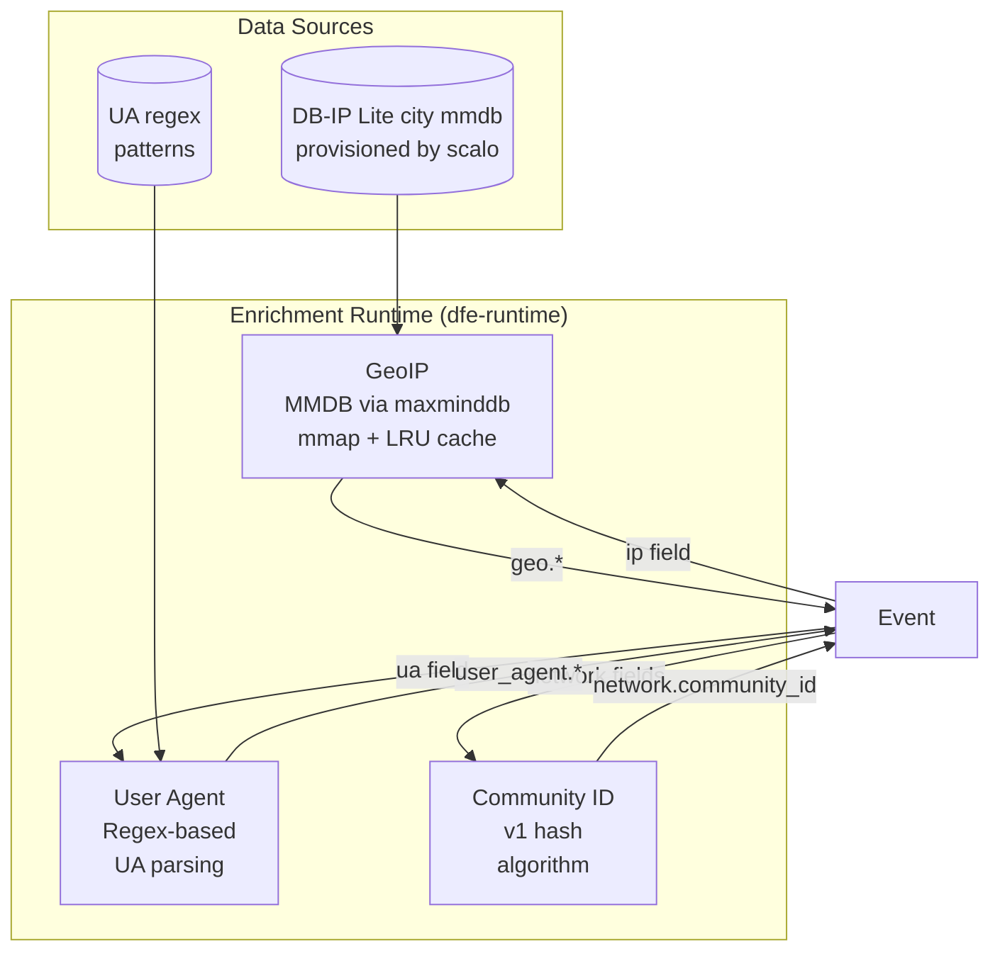

# Enrichment

GeoIP, user agent and community ID: the three runtime enrichers loaded once and shared across
every transform. The code map around them is [architecture.md](architecture.md), and the
processors that call them are listed in [parsers.md](parsers.md).

Runtime enrichment modules loaded once, shared across transforms:



---

## Enrichment trait

```rust
pub trait Enrichment: Send + Sync {
    fn enrich(&self, event: &mut Event) -> Result<()>;
}
```

---

## GeoIP design

- **Provisioning:** the config's `geoip` section is scalo's `GeoIpConfig` verbatim, because provisioning is shared across the fleet while the lookup engine and its cache stay in `dfe-runtime`. It defaults to ENABLED with auto-download from DB-IP Lite, so an operator gets databases without configuring anything, and it is read once at startup.
- **Storage:** mmap'd MMDB via `maxminddb` crate (zero-copy read)
- **Cache:** an LRU cache in front of the MMDB reader (`crates/dfe-runtime/src/enrichment/geoip_cache.rs`), 100,000 entries by default, a quarter evicted at a time when full. 325 of the 1,069 generated data-stream modules carry a geoip call, 2,953 call sites between them, so a single 20k-event batch can hit the cache several times per event. Re-derive both counts by scanning `crates/dfe-transforms/src/filebeat/` rather than trusting these -- the previous pair, "14 of the 60 source pipelines", predated most of the tree.
- **Output fields:** `country_name`, `country_iso_code`, `city_name`, `location.lat`, `location.lon`, `continent_name`, `timezone`
- **Failure:** `ignore_missing` support, errors tagged not fatal

---

## User agent design

- **Parser:** Regex-based UA string parsing
- **Output fields:** `name`, `version`, `os.name`, `os.version`, `device.name`, `device.type`

---

## Community ID design

- **Algorithm:** Community ID v1 (SHA-1 based network flow hash)
- **Input fields:** `source.ip`, `destination.ip`, `source.port`, `destination.port`, `network.transport`
- **Output:** `network.community_id` (e.g., `1:LQU9qZlK+B5F3KDmev6m5PMibrg=`)
