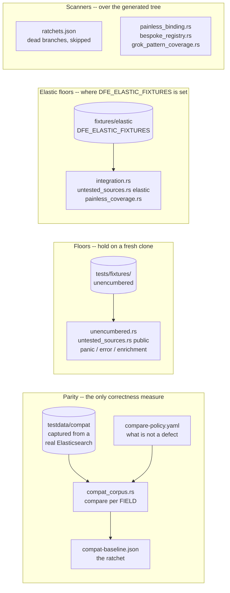

# Testing

The three test tracks -- the parity corpus, the fixture floors, the scanners over the generated
tree -- and the match modes and non-English sweeps they run under. The code map around them is
[architecture.md](architecture.md), what parity means is [parity.md](parity.md), and how the
corpus is produced is [compat.md](compat.md).

Three tracks, and only the first measures parity.



The corpus is GITIGNORED, so it exists only where it has been generated. Its absence makes
`compat_corpus.rs` pass, which is why a run outside the main tree needs `DFE_COMPAT_CORPUS`
pointed at one.

---

## Elastic test data

The pipeline-test fixtures and the Beats envelope shapes are copied from `elastic/integrations` and `elastic/beats`, which are Elastic License 2.0, so they are kept outside this repository, in a `fixtures/elastic/` directory. That directory is laid out like this repository's root, so `tests/fixtures/okta/system/` names the same fixture in both.

Every test that reads them is `#[ignore]`d here and reaches the data through `dfe_runtime::testutil::elastic_fixtures()`, which panics when `DFE_ELASTIC_FIXTURES` is unset or names no `tests/fixtures`. A run that asks for them therefore fails rather than passing on nothing:

```bash
export DFE_ELASTIC_FIXTURES=/path/to/fixtures/elastic
cargo test -p dfe-transforms --test integration --test untested_sources \
  --test painless_coverage --test grok_capture_paths -- --ignored
cargo test -p dfe-runtime --all-features --lib --test date_repro -- --ignored
cargo test --no-default-features --test envelope --test envelope_detection \
  -- --include-ignored
```

A CI job with access to that data runs those, plus the Python-tooling checks, against `main` on a schedule and on any change to the data. Only licence-clean samples go in `tests/fixtures/`, and `crates/dfe-transforms/tests/unencumbered.rs` fails on any file outside `unencumbered/`.

---

## Match modes

`crates/dfe-runtime/src/testutil/diff.rs` defines `MatchMode`:

| Mode | Use Case | Behaviour |
|---|---|---|
| **Exact** | Default | Field-for-field JSON match |
| **Semantic** | Non-deterministic fields | Ignore timestamps with "now", generated UUIDs, GeoIP, user agent |
| **Subset** | Fields set by Beats runtime | Expected is subset of actual (extra fields OK) |

---

## Non-English input

`tests/unicode.rs` runs every registered transform against seventeen scripts and a set of
degenerate inputs, so multi-byte and malformed text is a first-class case rather than an edge
case discovered in production.
